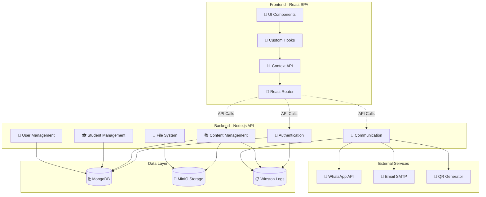
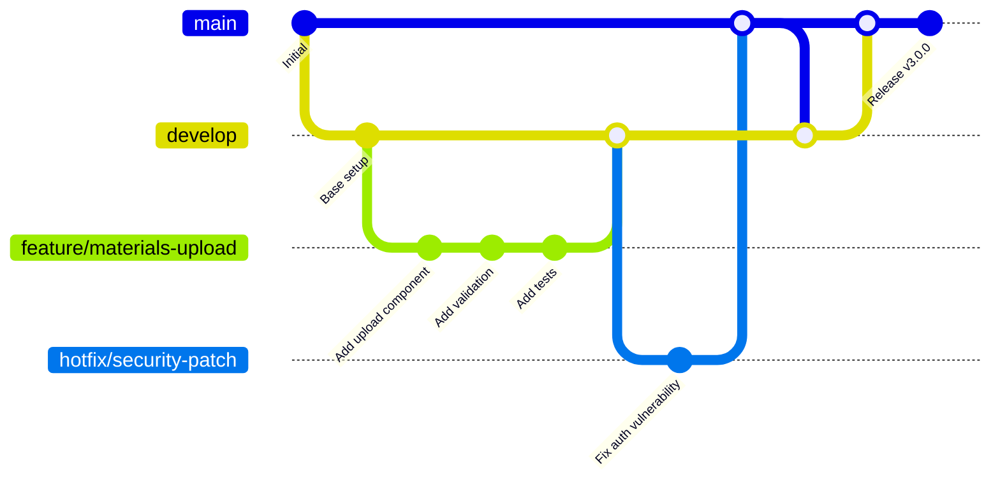

# 🎵 Sistema de Gestión - Escuela de Música

[](https://nodejs.org/)
[](https://reactjs.org/)
[](https://expressjs.com/)
[](https://www.mongodb.com/)
[](LICENSE)

## 📖 Descripción

Sistema integral de gestión para escuelas de música que combina una **aplicación web moderna** con una **API REST robusta**. Diseñado para facilitar la administración de materiales educativos, gestión de estudiantes, comunicación multi-canal y contenido web dinámico.

### 🎯 Características Principales

- 🎼 **Gestión Completa de Materiales**: Upload, categorización y control de acceso
- 👨‍🎓 **Administración de Estudiantes**: Datos académicos, progreso y seguimiento
- 💬 **Comunicación Multi-Canal**: WhatsApp Web, Business API, Email integrado
- 🔐 **Seguridad Avanzada**: JWT, RBAC, rate limiting, validaciones
- 📱 **Interfaz Moderna**: React 19 con arquitectura de componentes en 3 capas
- 🏗️ **Arquitectura Escalable**: Backend modular por features, frontend por dominios
- 💾 **Almacenamiento Seguro**: MinIO con URLs pre-firmadas y control granular
- 📊 **Logging Estructurado**: Winston con auditoría completa y monitoreo

---

## Arquitectura General

```
escuela-musica/
├── frontend/   # Aplicación React con Vite
├── backend/    # API REST Node.js/Express
├── docs/       # Documentación técnica
└── scripts/    # Scripts de utilidad
```

### 🛠️ Stack Tecnológico

#### **Frontend (React SPA)**
- **⚛️ Core**: React 19.1.0 + Vite 6.3.5 (HMR, ESM nativo)
- **🧭 Routing**: React Router DOM 7.1.1 con lazy loading
- **🎨 UI/UX**: Material-UI 7.2.0 + CSS Modules + Tema oscuro
- **📊 Estado**: Context API + Custom Hooks avanzados
- **🧪 Testing**: Vitest + React Testing Library + E2E
- **📦 Build**: Rollup optimizado con code splitting

#### **Backend (Node.js API)**
- **🚀 Runtime**: Node.js 16+ + Express 5.1.0
- **🗄️ Database**: MongoDB 4.4+ con Mongoose 8.15.2
- **💾 Storage**: MinIO 8.0.5 con buckets especializados
- **🔐 Auth**: JWT + Refresh Tokens + bcrypt
- **📡 Communication**: WhatsApp Web + Business API + Nodemailer
- **📋 Logging**: Winston 3.17.0 con rotación automática
- **🛡️ Security**: Helmet + CORS + Rate Limiting + Joi validation

#### **🔧 DevOps y Herramientas**
- **📋 Linting**: ESLint 9+ + Standard JS
- **🧪 Testing**: Jest + Supertest + Coverage reports
- **📦 Process**: PM2 + Concurrently para desarrollo
- **🐳 Containerization**: Docker ready
- **🔍 Debugging**: Scripts especializados + Health checks

---

## Estructura del Proyecto

### Frontend
```
frontend/
├── src/
│   ├── components/      # Componentes reutilizables
│   ├── hooks/           # Custom hooks
│   ├── pages/           # Páginas principales
│   ├── services/        # Servicios de API
│   ├── utils/           # Utilidades
│   └── contexts/        # Contextos de React
├── public/              # Assets estáticos
└── dist/                # Build de producción
```

### Backend (Arquitectura Feature-based)
```
backend/
├── src/
│   ├── core/                    # Infraestructura compartida
│   │   ├── config/             # Configuraciones
│   │   ├── constants/          # Constantes globales
│   │   ├── models/             # Modelos de base de datos
│   │   ├── repositories/       # Repositorios base
│   │   ├── schemas/            # Esquemas de validación
│   │   ├── services/           # Servicios base
│   │   └── utils/              # Utilidades de infraestructura
│   ├── features/               # Funcionalidades por dominio
│   │   ├── authentication/    # Autenticación y autorización
│   │   ├── communication/     # Mensajería y notificaciones
│   │   ├── content-management/# Gestión de materiales
│   │   ├── file-system/       # Sistema de archivos
│   │   ├── monitoring/        # Auditoría y monitoreo
│   │   ├── student-management/# Gestión de estudiantes
│   │   ├── user-management/   # Gestión de usuarios
│   │   └── website-content/   # Contenido del sitio
│   ├── middlewares/           # Middlewares globales
│   ├── patterns/              # Patrones reutilizables
│   └── routes/                # Enrutamiento principal
├── scripts/                   # Scripts de utilidad
└── logs/                      # Archivos de logs
```

---

## 🎭 Arquitectura del Sistema

### 🏗️ Vista de Alto Nivel



### 🎯 Principios de Diseño

- **🏗️ Modular Architecture**: Separación clara entre frontend/backend
- **🔄 Feature-Based Backend**: Organización por dominios de negocio
- **📱 Component-Based Frontend**: Arquitectura en 3 capas (Base → Configurable → Domain)
- **🔐 Security First**: Múltiples capas de seguridad y validación
- **📊 Observable**: Logging estructurado y monitoreo completo
- **⚡ Performance**: Caching inteligente y optimizaciones
- **🧪 Testable**: Cobertura de tests y debugging avanzado

---

## 🚀 Funcionalidades

### 📚 Gestión Avanzada de Materiales
- **🔄 Upload Multi-formato**: PDF, imágenes, audio, video con drag & drop
- **🏷️ Categorización Inteligente**: Tags, niveles, instrumentos, metadatos
- **🔐 Control Granular**: Acceso público/privado por material y usuario
- **🔍 Búsqueda Avanzada**: Filtros combinados, full-text search
- **🖼️ Galería Dinámica**: Gestión de imágenes con orden personalizable
- **📊 Analytics**: Tracking de descargas y uso por material
- **⚡ Performance**: URLs pre-firmadas con TTL y cache inteligente

### 👥 Sistema de Usuarios y Roles
- **🔑 Autenticación Robusta**: JWT + Refresh tokens con expiración configurable
- **👑 Jerarquía de Roles**: Administrador → Profesor → Asistente
- **🛡️ Permisos Granulares**: Control de acceso por recurso y acción
- **👤 Perfiles Completos**: Datos académicos, preferencias, historial
- **🔒 Seguridad Avanzada**: Rate limiting, validación RUT, 2FA ready
- **📊 Auditoría Completa**: Tracking de acciones y cambios críticos

### 🎓 Gestión Integral de Estudiantes
- **📋 Datos Completos**: Estudiante + Apoderado + Información académica
- **🎼 Perfil Musical**: Instrumentos, estilos, nivel de experiencia
- **🏥 Información Médica**: Condiciones especiales, medicamentos, emergencias
- **📈 Seguimiento Académico**: Progreso, horarios, asignación de profesores
- **📞 Contactos Múltiples**: Gestión de apoderados y contactos de emergencia
- **📊 Reportes**: Estadísticas por instrumento, nivel, profesor

### 💬 Sistema de Comunicación Multi-Canal
- **📱 WhatsApp Integrado**: 3 proveedores (Web, Business API, CallMeBot)
- **📧 Email Dinámico**: Configuración SMTP + plantillas HTML personalizables
- **🔲 Códigos QR**: Generación automática para WhatsApp Web
- **📋 Plantillas**: Variables dinámicas {{nombre}}, {{fecha}}, {{instrumento}}
- **🔄 Sistema Fallback**: Cambio automático entre proveedores
- **📊 Tracking Completo**: Estado de envío, entrega y logs detallados
- **⚡ Envío Masivo**: Mensajes a múltiples destinatarios con personalización

### 🌐 Gestión de Contenido Web
- **🎠 Carousel Dinámico**: Imágenes con orden personalizable y enlaces
- **👨‍🏫 Perfiles de Profesores**: Cards con especialidades, tarifas, horarios
- **🖼️ Galería Optimizada**: Imágenes de alta calidad con lazy loading
- **📱 SEO Friendly**: Metadatos dinámicos y URLs optimizadas
- **⚡ Cache Inteligente**: Optimización de rendimiento automática
- **🎨 Tema Dinámico**: Modo oscuro/claro con preferencias persistentes

---

## Instalación y Configuración

### Prerrequisitos
```bash
node >= 16.0.0
npm >= 8.0.0
MongoDB >= 4.4
MinIO Server
```

### Configuración del Backend
```bash
cd backend
npm install

# Configurar variables de entorno
cp .env.example .env
# Editar .env con las configuraciones necesarias

# Crear roles por defecto
node scripts/createDefaultRoles.js

# Verificar MinIO (opcional)
node scripts/check-minio.js

# Ejecutar servidor
npm run dev
```

### Configuración del Frontend
```bash
cd frontend
npm install
npm run dev
```

### 🔧 Variables de Entorno Backend
```env
# 🚀 Configuración del servidor
NODE_ENV=development
PORT=80
JWT_SECRET=tu_jwt_secret_muy_seguro
JWT_EXPIRES_IN=1d
JWT_REFRESH_EXPIRES_IN=7d

# 🗄️ Base de datos
MONGODB_URI=mongodb://localhost:27017/escuela_musica

# 💾 MinIO Storage (4 buckets especializados)
MINIO_ENDPOINT=localhost
MINIO_PORT=9000
MINIO_USE_SSL=false
MINIO_ACCESS_KEY=tu_access_key
MINIO_SECRET_KEY=tu_secret_key
MINIO_BUCKET_PRIVATE=materiales-privados
MINIO_BUCKET_PUBLIC=materiales-publicos
MINIO_BUCKET_GALERY=galeria-imagenes
MINIO_BUCKET_TEMP=temporal-uploads

# 📧 Configuración de email
EMAIL_HOST=smtp.gmail.com
EMAIL_PORT=587
EMAIL_USER=tu_email@gmail.com
EMAIL_PASS=tu_app_password
EMAIL_FROM=escuela@musica.com

# 📱 WhatsApp APIs
WHATSAPP_BUSINESS_TOKEN=tu_business_token
WHATSAPP_PHONE_ID=tu_phone_id
CALLMEBOT_API_KEY=tu_callmebot_key

# 📋 Logging
LOG_LEVEL=info
LOG_MAX_FILES=5
LOG_MAX_SIZE=20971520
```

### ⚙️ Variables de Entorno Frontend
```env
# 🔗 API Configuration
VITE_API_BASE_URL=http://localhost:80
VITE_API_TIMEOUT=10000

# 🎨 UI Configuration
VITE_APP_TITLE="Escuela de Música"
VITE_DEFAULT_THEME=light
VITE_ENABLE_DARK_MODE=true

# 📊 Feature Flags
VITE_ENABLE_ANALYTICS=false
VITE_ENABLE_DEBUG=true
```

---

## 🔌 API Endpoints Principales

### 🔐 Autenticación y Autorización
```http
POST   /api/auth/login           # Login con username/email + password
POST   /api/auth/logout          # Logout con revocación de tokens
POST   /api/auth/refresh         # Renovar access token (refresh token)
GET    /api/auth/verify          # Verificar validez del token actual
```

### 📚 Gestión de Materiales
```http
GET    /api/materials                    # Listar con filtros avanzados
POST   /api/materials/upload-url         # Generar URL pre-firmada
POST   /api/materials/confirm-upload     # Confirmar subida + metadatos
GET    /api/materials/:id/download-url   # URL temporal de descarga
PUT    /api/materials/:id                # Actualizar metadatos
DELETE /api/materials/:id                # Eliminar material + archivo

# Filtros disponibles:
# ?category=partitura&level=beginner&instrument=piano&search=escalas
```

### 💾 Sistema de Archivos
```http
GET    /api/files/health                 # Health check MinIO
GET    /api/files/:bucket/:filename      # Download directo (autenticado)
DELETE /api/files/:bucket/:filename      # Eliminar de bucket
GET    /api/files/buckets/info           # Info de uso por bucket
```

### 👥 Gestión de Usuarios (Admin)
```http
GET    /api/users                # Lista paginada con roles
POST   /api/users                # Crear usuario + asignar roles
GET    /api/users/:id            # Perfil completo + historial
PUT    /api/users/:id            # Actualizar datos + roles
DELETE /api/users/:id            # Soft delete + auditoría
```

### 🎓 Gestión de Estudiantes
```http
GET    /api/alumnos              # Lista con filtros (instrumento, nivel)
POST   /api/alumnos              # Registro completo (estudiante + apoderado)
GET    /api/alumnos/:id          # Perfil académico completo
PUT    /api/alumnos/:id          # Actualizar información
GET    /api/alumnos/search/:term # Búsqueda por nombre/RUT
GET    /api/alumnos/stats        # Estadísticas por instrumento/nivel
```

### 💬 Sistema de Comunicación
```http
POST   /api/messaging/send-whatsapp      # Envío WhatsApp multi-proveedor
POST   /api/messaging/send-email         # Envío email con plantillas
GET    /api/messaging/whatsapp-web/qr    # Código QR para conexión
GET    /api/messaging/config-status      # Estado de configuraciones
PUT    /api/messaging/email-config       # Configuración SMTP dinámica
```

### 🌐 Contenido Web
```http
GET    /api/carousel                     # Imágenes del carousel
POST   /api/carousel/upload-url          # Subir imagen carousel
PUT    /api/carousel/:id/order           # Reordenar carousel

GET    /api/cards-profesores             # Cards de profesores
POST   /api/cards-profesores             # Crear perfil profesor
POST   /api/cards-profesores/:id/image   # Subir foto profesor
```

### 📈 Administración y Monitoreo
```http
GET    /api/admin/stats                  # Estadísticas del sistema
GET    /api/admin/health                 # Health check completo
GET    /api/admin/audit                  # Logs de auditoría
GET    /api/admin/audit/user/:id         # Auditoría por usuario
```

---

## Scripts de Desarrollo

### 🎨 Frontend Scripts
```bash
# 🚀 Desarrollo
npm run dev           # Vite dev server con HMR
npm run build         # Build optimizado para producción
npm run preview       # Preview del build local

# 🧪 Testing
npm test              # Vitest con watch mode
npm run test:ui       # UI interactiva para tests
npm run test:coverage # Reporte de cobertura
npm run test:e2e      # Tests end-to-end

# 🔍 Calidad de Código
npm run lint          # ESLint con auto-fix
npm run lint:check    # Solo verificar sin fix
npm run type-check    # TypeScript type checking
```

### ⚙️ Backend Scripts
```bash
# 🚀 Desarrollo
npm run dev           # Nodemon con hot reload
npm run server        # Alias para dev
npm start             # Backend + Frontend concurrente
npm run cliente       # Solo frontend desde backend

# 🧪 Testing
npm run test-whatsapp # Test completo WhatsApp Web
npm run check-minio   # Verificar configuración MinIO

# 🔍 Calidad de Código
npm run lint          # Standard JS linter
```

### 🛠️ Scripts de Utilidad Avanzados
```bash
# 🔧 Configuración y Diagnóstico
node backend/scripts/check-minio.js              # Verificar buckets y conexión
node backend/scripts/check-users.js              # Listar usuarios y roles
node backend/scripts/createDefaultRoles.js       # Setup inicial de roles

# 🔄 Migración y Mantenimiento
node backend/scripts/migrate-images.js           # Migrar entre buckets
node backend/scripts/cleanup-old-bucket.js       # Limpiar archivos obsoletos
node backend/scripts/update-profesor-images.js   # Actualizar fotos profesores

# 🐛 Debug y Testing
node backend/scripts/debug-roles.js              # Debug sistema de roles
node backend/scripts/test-user-passwords.js      # Verificar hashes
node backend/scripts/list-bucket-contents.js     # Contenido de buckets

# 📱 Tests Específicos WhatsApp
node test/test-whatsapp-complete.js              # Suite completa WhatsApp
node test/test-qr-debug.js                       # Debug códigos QR
node test/run-whatsapp-tests.js                  # Tests automatizados

# 🔍 Debug de API
node test/debug-auth.js                          # Debug autenticación
node test/debug-middleware-flow.js               # Flujo de middlewares
node test/test-post-complete.js                  # Test endpoints POST
```

---

## Arquitectura Técnica

### 🏗️ Patrones Arquitectónicos

#### **Backend - Feature-Based Architecture**
- **🎯 Domain-Driven Design**: Organización por dominios de negocio
- **📦 Repository Pattern**: Abstracción de acceso a datos con BaseRepository
- **✅ Result Pattern**: Manejo consistente de respuestas y errores
- **⚙️ Service Layer**: Encapsulación de lógica de negocio reutilizable
- **🔗 Middleware Chain**: Procesamiento por capas (auth → validation → business)
- **🧩 Dependency Injection**: Servicios modulares e intercambiables

#### **Frontend - Component-Based Architecture**
- **📦 Three-Layer Components**: Base → Configurable → Domain
- **🔗 Custom Hooks**: Lógica reutilizable (useCrudManager, useApiCall)
- **📊 Context API**: Estado global sin prop drilling
- **🎨 Material Design**: UI consistente con componentes reutilizables
- **⚡ Code Splitting**: Carga lazy de rutas y componentes
- **🧪 Test-Driven**: Cobertura de tests para componentes críticos

### 🛡️ Seguridad Multi-Capa

#### **Autenticación y Autorización**
- **🔑 JWT + Refresh Tokens**: Expiración configurable (1d + 7d)
- **🔒 Bcrypt Hashing**: Salt rounds 12 para contraseñas
- **👑 Role-Based Access Control**: Jerarquía administrador → profesor → asistente
- **🚫 Token Blacklist**: Revocación inmediata de tokens comprometidos
- **⏰ Session Management**: Control de sesiones concurrentes

#### **Validación y Sanitización**
- **✅ Joi Schemas**: Validación exhaustiva de entrada
- **🧹 Input Sanitization**: Escape de XSS y SQL injection
- **📁 File Validation**: Tipos MIME, tamaños, malware scanning
- **🌐 CORS Policy**: Dominios autorizados únicamente
- **🚨 Rate Limiting**: Protección contra ataques de fuerza bruta

#### **Headers y Protección**
- **🛡️ Helmet.js**: Headers de seguridad automáticos
- **🔒 HTTPS Enforcement**: Redirects automáticos en producción
- **🍪 Secure Cookies**: HttpOnly + Secure + SameSite
- **📏 Content Security Policy**: Prevención de XSS

### 🗄️ Base de Datos - MongoDB

#### **Modelos Principales (7)**
```javascript
User          → Usuarios con roles y autenticación
Role          → Sistema de roles jerárquico
Material      → Materiales educativos con metadatos
Alumno        → Estudiantes (datos + apoderado + académicos)
Galeria       → Imágenes para sitio web
CardsProfesores → Perfiles de profesores
Carousel      → Carousel dinámico del sitio
EmailTemplate → Plantillas de mensajes
```

#### **Relaciones Optimizadas**
```javascript
User ←→ Role           (Many-to-Many) - Roles múltiples por usuario
User → Material        (One-to-Many)  - Ownership de materiales
User → Alumno          (One-to-Many)  - Profesor asignado
Material → MinIO       (Reference)    - Archivos en storage
```

#### **Índices de Performance**
- **Únicos**: username, email, rut (usuarios y alumnos)
- **Compuestos**: categoria + nivel, owner + isPublic
- **Text Search**: Búsqueda full-text en materiales
- **TTL**: Limpieza automática de tokens expirados

### 💾 Almacenamiento - MinIO

#### **4 Buckets Especializados**
```javascript
materiales-privados  → Contenido restringido por rol
materiales-publicos  → Contenido accesible públicamente
galeria-imagenes     → Imágenes del sitio web optimizadas
temporal-uploads     → Archivos temporales con TTL
```

#### **Características Avanzadas**
- **🔗 URLs Pre-firmadas**: TTL configurable (5min default)
- **🔐 Políticas Granulares**: Acceso por bucket y usuario
- **⚡ Cache Inteligente**: URLs cacheadas para performance
- **🧹 Limpieza Automática**: Archivos temporales con expiración
- **📊 Health Monitoring**: Checks automáticos de conectividad
- **🔄 Replicación**: Backup automático configurado

---

## Testing

### 🧪 Testing Strategy

#### **Frontend Testing (Vitest + RTL)**
```javascript
// 🧩 Component Testing
├── Unit Tests          → Componentes aislados
├── Integration Tests   → Flujos de usuario
├── Hook Tests          → Custom hooks (useCrudManager)
├── E2E Tests           → Cypress para flujos críticos
└── Visual Tests        → Storybook para UI consistency

// 📊 Coverage Targets
Components: 85%+        → UI crítica
Hooks: 90%+             → Lógica de negocio
Services: 95%+          → API calls
```

#### **Backend Testing (Jest + Supertest)**
```javascript
// 🔧 Test Types
├── Unit Tests          → Servicios y utilities
├── Integration Tests   → APIs + Database
├── E2E Tests           → Flujos completos
├── Load Tests          → Performance bajo carga
└── Security Tests      → Vulnerabilidades

// 🎯 Coverage Requirements
Controllers: 80%+       → Endpoints críticos
Services: 90%+          → Lógica de negocio
Middlewares: 95%+       → Seguridad y validación
```

#### **Test Utilities y Mocking**
- **🗄️ Database Mocking**: MongoDB Memory Server
- **📁 MinIO Mocking**: Mock storage para tests
- **📧 Communication Mocking**: WhatsApp + Email simulados
- **🔐 Auth Mocking**: JWT tokens de test
- **📊 Fixtures**: Datos de prueba realistas

---

## Despliegue

### 🚀 Deployment Strategies

#### **🏠 Desarrollo Local**
```bash
# 1. 🗄️ Configurar dependencias
docker-compose up -d mongodb minio  # Servicios en Docker
# O instalar MongoDB + MinIO nativamente

# 2. 📦 Setup del proyecto
git clone <repo-url>
cd escuela-musica

# 3. ⚙️ Backend setup
cd backend
npm install
cp .env.example .env
# Editar .env con configuraciones locales
node scripts/createDefaultRoles.js
node scripts/check-minio.js

# 4. 🎨 Frontend setup
cd ../frontend
npm install
cp .env.example .env.local

# 5. 🚀 Iniciar desarrollo
# Terminal 1: Backend
cd backend && npm run dev

# Terminal 2: Frontend
cd frontend && npm run dev

# O usar concurrently desde backend:
cd backend && npm start  # Inicia ambos
```

#### **🏭 Producción con PM2**
```bash
# 📦 Preparación
export NODE_ENV=production
npm ci --only=production

# 🎨 Build frontend
cd frontend
npm run build
cp -r dist/* /var/www/html/  # Nginx/Apache

# ⚙️ Deploy backend
cd backend
pm2 start ecosystem.config.js
pm2 save
pm2 startup  # Auto-start

# 📊 Monitoreo
pm2 monit
pm2 logs
```

#### **🐳 Docker Deployment**
```dockerfile
# docker-compose.yml completo
version: '3.8'
services:
  frontend:
    build: ./frontend
    ports: ["3000:3000"]
    environment:
      - VITE_API_BASE_URL=http://backend:80
  
  backend:
    build: ./backend
    ports: ["80:80"]
    env_file: .env
    depends_on: [mongodb, minio]
  
  mongodb:
    image: mongo:4.4
    volumes: ["mongodb_data:/data/db"]
  
  minio:
    image: minio/minio
    command: server /data --console-address ":9001"
    ports: ["9000:9000", "9001:9001"]
    volumes: ["minio_data:/data"]
    environment:
      MINIO_ACCESS_KEY: ${MINIO_ACCESS_KEY}
      MINIO_SECRET_KEY: ${MINIO_SECRET_KEY}

volumes:
  mongodb_data:
  minio_data:
```

#### **☁️ Cloud Deployment (AWS/GCP)**
```bash
# 🏗️ Infrastructure as Code (Terraform)
terraform/
├── main.tf           # ECS + RDS + S3
├── variables.tf      # Configuración
└── outputs.tf        # URLs y endpoints

# 🚀 CI/CD Pipeline (GitHub Actions)
.github/workflows/
├── test.yml          # Tests en PR
├── build.yml         # Build y push Docker
└── deploy.yml        # Deploy automático
```

---

## Estructura de Desarrollo

### 🔄 Flujo de Desarrollo

#### **📋 Git Workflow - GitFlow Simplificado**


#### **📝 Convenciones de Código**
```javascript
// 🏷️ Conventional Commits
feat: add WhatsApp Web integration
fix: resolve JWT token expiration issue
docs: update API documentation
test: add integration tests for materials
refactor: optimize file upload performance
chore: update dependencies

// 📁 Naming Conventions
Components: PascalCase      → MaterialsList.jsx
Files: kebab-case          → material-service.js
Variables: camelCase       → isAuthenticated
Constants: SCREAMING_SNAKE → API_BASE_URL
Database: snake_case       → created_at
```

#### **🔍 Code Quality Gates**
```bash
# 🧪 Pre-commit Hooks (Husky)
├── Lint staged files      → ESLint + Prettier
├── Run affected tests     → Jest/Vitest
├── Type checking          → TypeScript (if enabled)
├── Commit message format  → Conventional commits
└── Bundle size check      → Prevent bloat

# 📊 PR Requirements
├── All tests passing      → CI/CD pipeline
├── Code coverage ≥ 80%    → Critical paths
├── No security alerts     → SAST scanning
├── Performance budget     → Lighthouse checks
└── 2+ approvals          → Code review
```

#### **📚 Documentation Standards**
```javascript
// 🔧 JSDoc para funciones públicas
/**
 * Uploads a material file to MinIO and creates database record
 * @param {File} file - The file to upload
 * @param {Object} metadata - Material metadata
 * @param {string} metadata.name - Display name
 * @param {string} metadata.category - Material category
 * @param {Function} onProgress - Progress callback
 * @returns {Promise<{success: boolean, data?: Object, error?: string}>}
 * @example
 * const result = await uploadMaterial(file, { name: 'Escalas Piano', category: 'ejercicio' })
 */

// 📋 README Templates
README.md           → Proyecto general
frontend/README.md  → Documentación específica
backend/README.md   → API + arquitectura
DESARROLLO_*.md     → Guías de implementación
```

---

## Monitoreo y Logs

### 📋 Logging Estructurado (Winston)
```javascript
// 🗂️ Configuración Multi-Transport
Logger Configuration:
├── Console Transport      → Development debugging
├── File Transport        → Production logs
├── Error File           → Error-only logs
├── Rotation Policy      → 20MB max, 5 files
└── JSON Format          → Structured parsing

// 📊 Log Categories
Categories:
├── 📡 Request Logs       → HTTP requests + response times
├── 🔐 Auth Logs         → Login attempts + token operations
├── 📁 File Logs         → Upload/download operations
├── 💬 Communication     → WhatsApp/Email sending
├── ⚠️ Error Logs        → System errors + stack traces
└── 🔍 Audit Logs        → Critical data changes
```

### 📊 Monitoreo y Observabilidad
```javascript
// 🏥 Health Checks
Health Endpoints:
├── /api/health           → Basic system health
├── /api/health/detailed  → Component-by-component
├── MongoDB              → Connection + query time
├── MinIO                → Storage availability
├── WhatsApp Web         → Connection status
└── Email SMTP           → Configuration validity

// 📈 Métricas Clave
Metrics Tracked:
├── Response Times       → P50, P95, P99 percentiles
├── Error Rates         → 4xx/5xx by endpoint
├── Active Users        → Concurrent sessions
├── File Operations     → Upload/download rates
├── Database Queries    → Slow query detection
└── Memory/CPU Usage    → Resource utilization

// 🚨 Alerting Rules
Alert Conditions:
├── Error Rate > 5%      → Immediate notification
├── Response Time > 2s   → Performance degradation
├── Disk Space < 10%     → Storage warning
├── MongoDB Down         → Critical system failure
└── Failed Logins > 10   → Security incident
```

---

## Troubleshooting

### Problemas Comunes

#### **🗄️ Problemas de MongoDB**
```bash
# 🔍 Diagnóstico de conexión
systemctl status mongod                    # Estado del servicio
mongo --eval "db.adminCommand('ismaster')" # Test de conexión
tail -f /var/log/mongodb/mongod.log       # Logs en tiempo real

# 🛠️ Soluciones comunes
sudo systemctl restart mongod              # Reiniciar servicio
echo $MONGODB_URI                         # Verificar variable de entorno
mongo $MONGODB_URI --eval "db.stats()"    # Test de base de datos

# 📊 Performance issues
db.currentOp()                            # Operaciones en curso
db.runCommand({"profile": 2})             # Habilitar profiling
db.system.profile.find().pretty()         # Ver queries lentas
```

#### **💾 Problemas de MinIO**
```bash
# 🔍 Diagnóstico completo
node backend/scripts/check-minio.js          # Script diagnóstico custom
curl http://localhost:9000/minio/health/live # Health check directo
mc admin info local                          # MinIO client info

# 🛠️ Configuración y buckets
cat backend/.env | grep MINIO                # Variables de entorno
mc ls local/                                # Listar buckets
mc policy get local/materiales-privados     # Verificar políticas

# 🚨 Problemas comunes
# Error: "Access Denied"
mc policy set public local/materiales-publicos

# Error: "Bucket not found"
node backend/scripts/create-buckets.js      # Crear buckets faltantes
```

#### **🔐 Problemas de Autenticación**
```bash
# 🔍 Debug de JWT
node test/debug-auth.js                     # Script debug custom
node -e "console.log(require('jsonwebtoken').decode('$TOKEN'))" # Decode token

# 🛠️ Reset de usuarios
node backend/scripts/check-users.js         # Listar usuarios
node backend/scripts/reset-admin-password.js # Reset password admin

# 🔐 Verificar permisos
db.users.find({username: "admin"}).pretty() # Usuario en MongoDB
db.roles.find().pretty()                    # Roles disponibles
```

#### **📱 Problemas de WhatsApp**
```bash
# 🔍 Diagnóstico WhatsApp Web
node test/test-whatsapp-complete.js         # Test completo
node test/test-qr-debug.js                  # Debug código QR

# 📊 Estado de la conexión
curl http://localhost:80/api/messaging/whatsapp-web/status

# 🔄 Reconexión
curl -X POST http://localhost:80/api/messaging/whatsapp-web/disconnect
# Luego obtener nuevo QR
curl http://localhost:80/api/messaging/whatsapp-web/qr
```

#### **📁 Problemas de Archivos y Permisos**
```bash
# 🔍 Verificar permisos
ls -la backend/logs/                        # Permisos de logs
ls -la uploads/                             # Permisos de uploads (si existe)

# 🛠️ Corregir permisos
sudo chown -R $USER:$USER backend/logs/     # Ownership correcto
chmod 755 backend/logs/                     # Permisos de directorio
chmod 644 backend/logs/*.log                # Permisos de archivos log

# 🧹 Limpieza de archivos temporales
find backend/logs/ -name "*.log" -mtime +30 -delete # Logs > 30 días
node backend/scripts/cleanup-temp-files.js  # Script de limpieza
```

#### **🚀 Problemas de Performance**
```bash
# 📊 Monitoreo de resources
top -p $(pgrep -f "node.*server.js")        # CPU/Memory del proceso
netstat -tulpn | grep :80                   # Conexiones del puerto

# 🔍 Análisis de logs
tail -f backend/logs/combined.log | grep "ERROR" # Errores en tiempo real
grep "slow query" backend/logs/combined.log  # Queries lentas

# 🛠️ Optimizaciones
npm run test:load                           # Load testing
node --inspect backend/src/server.js        # Debug con Chrome DevTools
```

---

## Roadmap

### 🚧 Roadmap 2025

#### **🎯 Q1 2025 - Performance & Quality**
- [ ] **⚡ Redis Caching**: Cache distribuido para sesiones y queries
- [ ] **📊 Swagger/OpenAPI**: Documentación interactiva de API
- [ ] **🧪 Test Coverage**: Alcanzar 90%+ en componentes críticos
- [ ] **🚀 CI/CD Pipeline**: GitHub Actions con deploy automático
- [ ] **📱 PWA Support**: App installable con service workers
- [ ] **🔍 Full-Text Search**: Elasticsearch para búsqueda avanzada

#### **🎯 Q2 2025 - Features & UX**
- [ ] **📲 Push Notifications**: Firebase Cloud Messaging
- [ ] **🤖 AI Integration**: Chatbot para soporte automático
- [ ] **📊 Analytics Dashboard**: Métricas de uso en tiempo real
- [ ] **🔗 GraphQL API**: API complementaria para consultas complejas
- [ ] **📱 Mobile App**: React Native con funcionalidades básicas
- [ ] **🌍 Internationalization**: Soporte multi-idioma

#### **🎯 Q3 2025 - Scalability & DevOps**
- [ ] **📈 Microservices**: Descomposición en servicios especializados
- [ ] **☁️ Cloud Native**: Migration completa a AWS/GCP
- [ ] **📊 Monitoring Stack**: Prometheus + Grafana + Alertmanager
- [ ] **🔒 Advanced Security**: 2FA + OAuth + SSO integration
- [ ] **🧩 Event Sourcing**: Auditoría completa con eventos
- [ ] **🚀 CDN Integration**: CloudFront para assets estáticos

#### **🎯 Q4 2025 - AI & Innovation**
- [ ] **🎵 ML Recommendations**: Recomendación de materiales por IA
- [ ] **🎤 Voice Integration**: Comandos de voz para navegación
- [ ] **📊 Predictive Analytics**: Predicción de abandono de alumnos
- [ ] **🎨 Dynamic Themes**: Temas personalizables por usuario
- [ ] **🔄 Offline Support**: Funcionalidad sin conexión
- [ ] **🌐 Federation**: Integración con otras escuelas

### 🏗️ Mejoras Técnicas Continuas

#### **Frontend Evolution**
```javascript
// 🔄 Architectural Improvements
├── TypeScript Migration     → Type safety completo
├── React 19 Concurrent     → Rendering optimizado
├── Suspense Boundaries     → Loading states mejorados
├── Micro-Frontends        → Modularity extrema
├── State Management       → Zustand/Redux Toolkit
└── Bundle Optimization    → Tree shaking avanzado
```

#### **Backend Evolution**
```javascript
// ⚡ Performance & Scalability
├── Database Sharding      → MongoDB horizontal scaling
├── Read Replicas         → Separación read/write
├── Message Queues        → Bull/Redis para jobs
├── Rate Limiting         → Distributed rate limiting
├── Caching Strategy      → Multi-layer caching
└── API Gateway          → Kong/Traefik integration
```

#### **DevOps & Infrastructure**
```yaml
# 🏗️ Infrastructure as Code
Terraform:
  - ECS/EKS clusters
  - RDS Multi-AZ
  - ElastiCache Redis
  - S3 + CloudFront
  - VPC + Security Groups

Kubernetes:
  - Helm charts
  - Horizontal Pod Autoscaling
  - Service Mesh (Istio)
  - GitOps (ArgoCD)
  - Monitoring (Prometheus)
```

---


---

## 📞 Contacto y Contribuciones

### 👥 Equipo de Desarrollo

| Rol | Nombre | Especialidad | GitHub |
|-----|--------|-------------|--------|
| 🏗️ **System Architect** | Gerardo Cadin | Backend Architecture | [@gcadin](https://github.com/gcadin) |
| 🚀 **Full Stack Lead** | Brian Cabezas | Full Stack Development | [@briancabezas](https://github.com/briancabezas) |
| ⚙️ **Backend Developer** | Bairon Sanhueza | API & Database | [@baironsanhueza](https://github.com/baironsanhueza) |
| 🎨 **Frontend Developer** | Victor Alguilera | React & UI/UX | [@valguilera](https://github.com/valguilera) |
| 🚀 **DevOps Engineer** | Cristian Torres | Infrastructure & CI/CD | [@ctorres](https://github.com/ctorres) |

### 🤝 Cómo Contribuir

1. **🍴 Fork** el repositorio
2. **🌿 Crear** rama feature: `git checkout -b feature/nueva-funcionalidad`
3. **✍️ Commit** cambios: `git commit -m 'feat: add nueva funcionalidad'`
4. **🚀 Push** a la rama: `git push origin feature/nueva-funcionalidad`
5. **📨 Crear** Pull Request con descripción detallada

### 🐛 Reportar Issues

- **🔗 GitHub Issues**: [Repositorio del proyecto](https://github.com/escuela-musica/sistema-gestion)
- **📧 Email**: dev-team@escuela-musica.com
- **💬 Discord**: [Canal de desarrollo](https://discord.gg/escuela-musica-dev)

### 📋 Templates de Issues

```markdown
# 🐛 Bug Report
**Descripción**: Descripción clara del problema
**Pasos para reproducir**: 
1. Paso 1
2. Paso 2
3. Error observado

**Comportamiento esperado**: Lo que debería pasar
**Screenshots**: Si aplica
**Entorno**: OS, Browser, Version
```

```markdown
# ✨ Feature Request
**Funcionalidad**: Descripción de la nueva feature
**Justificación**: Por qué es necesaria
**Alternativas**: Otras soluciones consideradas
**Mockups**: Diseños o wireframes si aplica
```

---

## 📜 Licencia y Términos

Este proyecto está licenciado bajo **ISC License** - ver el archivo [LICENSE](LICENSE) para detalles.

### 🔒 Consideraciones de Seguridad

- **🔐 Credenciales**: Nunca commitear secrets al repositorio
- **🛡️ Producción**: Usar HTTPS y certificados SSL válidos
- **💾 Backups**: Realizar backups regulares de MongoDB y MinIO
- **🚨 Monitoring**: Implementar alertas para errores críticos
- **📊 Compliance**: Cumplir con GDPR/LOPD para datos personales

### 🙏 Acknowledgments

- **⚛️ React Team** por el framework base
- **🚀 Express Community** por el ecosistema de middleware
- **🗄️ MongoDB** por la base de datos NoSQL
- **💾 MinIO** por el storage compatible con S3
- **🎨 Material-UI** por los componentes de interfaz
- **🧪 Testing Libraries** por las herramientas de testing

---

<div align="center">

**🎵 Sistema de Gestión - Escuela de Música**

[](https://github.com/escuela-musica)
[](https://reactjs.org/)
[](https://nodejs.org/)

**Versión**: 3.0.0 | **Última actualización**: 2025-01-24

**Stack**: React 19.1.0 | Express 5.1.0 | MongoDB 4.4+ | MinIO 8.0.5

[📖 Documentación](docs/) | [🐛 Issues](https://github.com/escuela-musica/issues) | [💬 Discussions](https://github.com/escuela-musica/discussions)

</div>