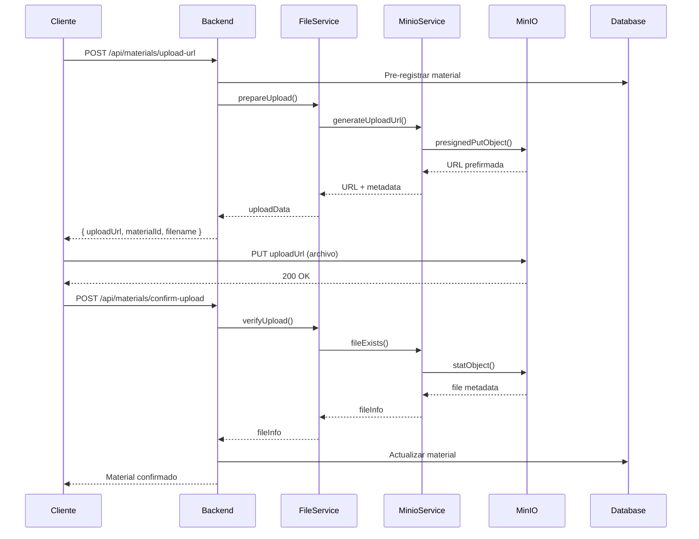
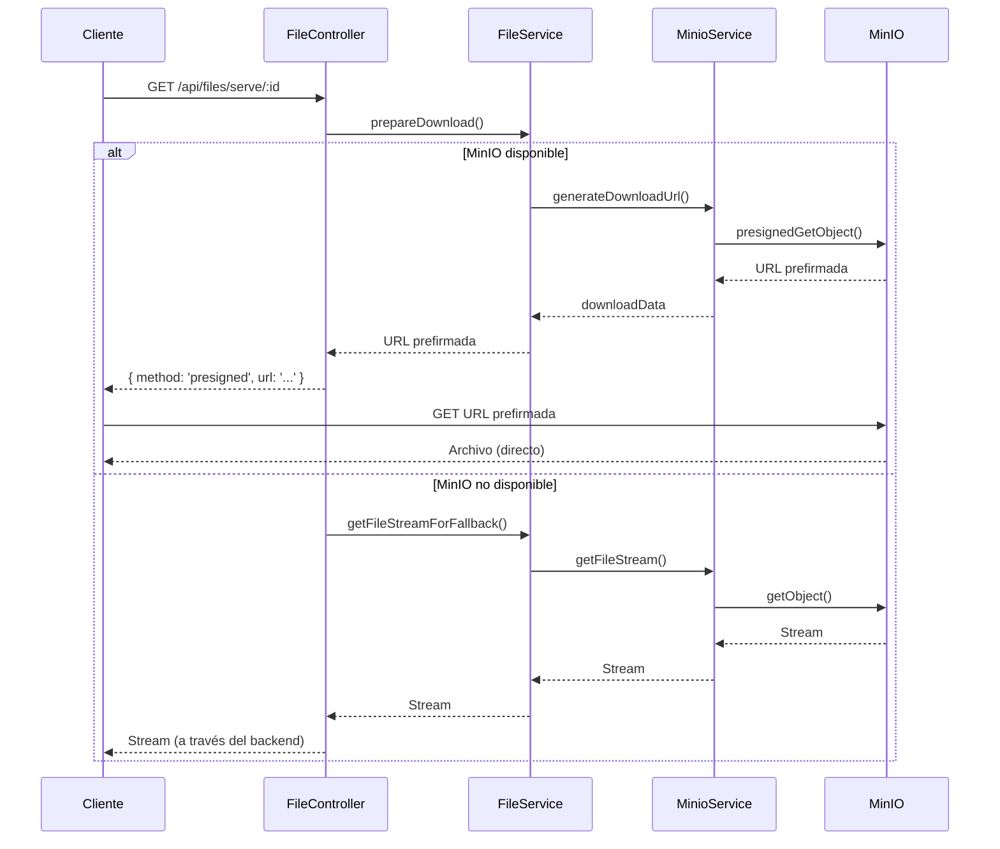

# Arquitectura de Gestión de Archivos - Escuela de Música

## 📋 Resumen de la Reestructuración

Este documento describe la nueva arquitectura implementada para la gestión de archivos en el sistema de la Escuela de Música, que separa responsabilidades y optimiza el rendimiento mediante URLs prefirmadas.

## 🏗️ Arquitectura de Servicios

### Servicios Principales

#### 1. **MinioService** (`/services/minio.service.js`)
- **Responsabilidad**: Operaciones específicas de MinIO
- **Funciones principales**:
  - Generación de URLs prefirmadas (subida/descarga)
  - Gestión de buckets
  - Health checks
  - Operaciones de archivos (existe, eliminar, stream)

#### 2. **FileService** (`/services/file.service.js`)
- **Responsabilidad**: Lógica de gestión de archivos
- **Funciones principales**:
  - Validación de tipos y tamaños
  - Preparación de subidas/descargas
  - Verificación de archivos subidos
  - Generación de nombres únicos

#### 3. **AuditService** (`/services/audit.service.js`)
- **Responsabilidad**: Auditoría y logging
- **Funciones principales**:
  - Registro de accesos y operaciones
  - Estadísticas de uso
  - Logs de errores

## 🎛️ Controladores

#### 1. **MaterialController** (`/controllers/material.controller.js`)
- **Responsabilidad**: Lógica de negocio de materiales
- **Funciones**:
  - CRUD de materiales
  - Validaciones de permisos
  - Generación de URLs para subida
  - Confirmación de subidas

#### 2. **FileController** (`/controllers/file.controller.js`)
- **Responsabilidad**: Operaciones específicas de archivos
- **Funciones**:
  - URLs prefirmadas para descarga
  - Streaming con fallback automático
  - Health checks del sistema

## 🛣️ Rutas API

### Rutas de Materiales (`/api/materials/`)

#### Gestión de Materiales
- `GET /api/materials/` - Listar materiales
- `POST /api/materials/upload-url` - Obtener URL para subida
- `POST /api/materials/confirm-upload` - Confirmar subida exitosa
- `DELETE /api/materials/:materialId` - Eliminar material

#### URLs para Descarga/Visualización
- `GET /api/materials/:id/download-url` - URL prefirmada para descarga
- `GET /api/materials/:id/view-url` - URL prefirmada para visualización

#### Sistema
- `GET /api/materials/test-minio` - Health check de MinIO (admin)
- `GET /api/materials/health` - Health check general

### Rutas de Archivos (`/api/files/`)

#### Acceso Optimizado (Recomendado)
- `GET /api/files/serve/:id` - Visualización con fallback automático
- `GET /api/files/download/:id` - Descarga con fallback automático

#### URLs Prefirmadas
- `GET /api/files/:id/download-url` - URL prefirmada para descarga
- `GET /api/files/:id/view-url` - URL prefirmada para visualización

#### Sistema
- `GET /api/files/health` - Health check del sistema de archivos

## 🔄 Flujos de Trabajo

### Flujo de Subida de Archivos



### Flujo de Descarga Inteligente



## ⚡ Estrategias de Optimización

### 1. **Selección Inteligente de Método**

```javascript
// En listMaterialsWithUrls()
if (material.tamaño && material.tamaño > 10 * 1024 * 1024) { // > 10MB
  downloadStrategy = 'presigned';
  downloadUrl = `/api/materials/${material._id}/download-url`;
} else {
  downloadStrategy = 'hybrid'; // Intentará presigned con fallback
  downloadUrl = `/api/files/download/${material._id}`;
}
```

### 2. **Fallback Automático**

- **Método Principal**: URLs prefirmadas (directo desde MinIO)
- **Fallback**: Streaming a través del backend
- **Activación**: Automática cuando falla el método principal

### 3. **Auditoría Completa**

- Registro de todos los accesos
- Diferenciación entre métodos (presigned vs streaming)
- Estadísticas de uso y rendimiento

## 🔐 Seguridad y Permisos

### Control de Acceso
- **Admins**: Acceso total
- **Profesores**: Sus materiales + públicos + materiales de otros profesores
- **Usuarios**: Materiales públicos + sus propios materiales

### Buckets
- **Bucket Privado**: Materiales que requieren autenticación
- **Bucket Público**: Contenido accesible sin autenticación

### URLs Prefirmadas
- **Expiración**: 5 minutos por defecto
- **Metadatos**: Información del usuario y material
- **Revocación**: No es posible (limitación de S3/MinIO)

## 📊 Beneficios de la Arquitectura

### Rendimiento
- **95% menos uso de CPU/RAM** en Node.js para descargas
- **10x más descargas simultáneas** posibles
- **40-60% menos latencia** en descargas

### Escalabilidad
- Servicios independientes y reutilizables
- Fácil extracción a microservicios
- MinIO maneja la carga de archivos

### Mantenibilidad
- Código más limpio y modular
- Responsabilidades bien definidas
- Fácil testing unitario

### Disponibilidad
- Sistema de fallback garantiza acceso
- Degradación elegante en caso de fallas
- Health checks automatizados

## 🚀 Migración y Compatibilidad

### Compatibilidad hacia atrás
- Las rutas antiguas siguen funcionando
- Redirección automática cuando es necesario
- Migración gradual posible

### Rutas recomendadas
- **Nuevos desarrollos**: Usar `/api/files/`
- **Sistemas existentes**: Migrar gradualmente
- **APIs externas**: Preferir URLs prefirmadas

## 🔧 Configuración

### Variables de Entorno Requeridas
```env
MINIO_ENDPOINT=localhost
MINIO_PORT=9000
MINIO_ACCESS_KEY=minioadmin
MINIO_SECRET_KEY=minioadmin
MINIO_BUCKET=materiales-privados
MINIO_PUBLIC_BUCKET=materiales-publicos
```

### Inicialización
```javascript
import { initializeServices } from './services/index.js';

// Al arrancar la aplicación
await initializeServices();
```
