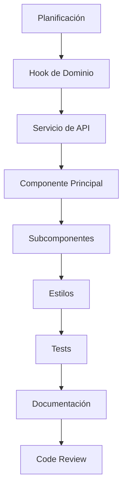

# 🎼 Frontend - Escuela de Música

## 📋 Descripción

Frontend profesional para sistema de gestión educativa de escuela de música. Aplicación React moderna con arquitectura por capas, autenticación basada en roles y gestión completa de materiales educativos, usuarios y recursos académicos.

**Versión actual:** React 19.1.0 | Material-UI 7.2.0 | Vite 6.3.5 | Actualizado: 2025-01-24

---

## 🏗️ Arquitectura del Sistema

### Principios de Diseño

El frontend implementa una **arquitectura por capas de abstracción** que promueve la reutilización, mantenibilidad y escalabilidad:

1. **Capa Base**: Componentes y hooks fundamentales
2. **Capa Configurable**: Componentes reutilizables y parametrizables
3. **Capa Dominio**: Componentes específicos del negocio

### Diagrama de Arquitectura

```
┌─────────────────────────────────────────────────────────────┐
│                    CAPA PRESENTACIÓN                        │
├─────────────────────────────────────────────────────────────┤
│  Pages/Routes → Domain Components → Auth & Layout           │
├─────────────────────────────────────────────────────────────┤
│                    CAPA LÓGICA                              │
├─────────────────────────────────────────────────────────────┤
│  Domain Hooks → Configurable Hooks → Base Hooks            │
├─────────────────────────────────────────────────────────────┤
│                    CAPA DATOS                               │
├─────────────────────────────────────────────────────────────┤
│  Services → API Config → Utils & Context                    │
└─────────────────────────────────────────────────────────────┘
```

---

## 📁 Estructura Detallada del Proyecto

### 🎯 Directorio Principal `/src/`

```
src/
├── 📱 Punto de Entrada
│   ├── main.jsx                    # Bootstrap de aplicación con providers
│   ├── App.jsx                     # Configuración de rutas principales
│   ├── App.css                     # Estilos base de la aplicación
│   ├── AppTest.jsx                 # Tests de la aplicación principal
│   ├── index.css                   # Estilos globales base
│   └── main.test.jsx               # Tests del punto de entrada
│
├── 🎨 Assets Estáticos
│   └── assets/
│       ├── cover.png               # Imagen de portada para materiales
│       ├── hero.jpg                # Hero image para landing page
│       ├── imagenprueba.jpg        # Imagen de prueba para desarrollo
│       └── maria.png               # Avatar/foto de perfil ejemplo
│
├── 🧩 Componentes (Arquitectura por Capas)
│   └── components/
│       ├── 🔧 base/                # CAPA 1: Componentes Fundamentales
│       │   ├── DomainManager.jsx   # [239 líneas] Gestor avanzado de dominio
│       │   └── ErrorBoundary.jsx   # [78 líneas] Manejo robusto de errores
│       │
│       ├── 🔄 common/              # CAPA 2: Componentes Genéricos CRUD
│       │   ├── DataManager.jsx     # [115 líneas] Gestor CRUD genérico
│       │   ├── DataTable.jsx       # [89 líneas] Tabla de datos reutilizable
│       │   └── FormDialog.jsx      # [67 líneas] Diálogo de formularios
│       │
│       ├── ⚙️ configurable/        # CAPA 2: Componentes Parametrizables
│       │   ├── FilterableGrid.jsx  # [201 líneas] Grid con filtros avanzados
│       │   ├── ReorderableList.jsx # [152 líneas] Lista drag & drop
│       │   ├── SearchableTable.jsx # [156 líneas] Tabla con búsqueda
│       │   ├── SelectionTable.jsx  # [203 líneas] Tabla con selección múltiple
│       │   └── StatusToggle.jsx    # [78 líneas] Toggle de estados
│       │
│       ├── 🎯 domain/              # CAPA 3: Componentes de Negocio
│       │   ├── 👑 admin/           # Administración del Sistema
│       │   │   ├── DataList.jsx    # [312 líneas] Lista administrativa genérica
│       │   │   ├── SimpleTest.jsx  # [15 líneas] Componente de prueba
│       │   │   └── registro_tareas_Login.txt # Registro de tareas pendientes
│       │   │
│       │   ├── 🎓 alumnos/         # Gestión de Estudiantes
│       │   │   ├── AlumnoForm/     # Formulario Completo de Alumno
│       │   │   │   ├── AlumnoForm.jsx      # [156 líneas] Formulario principal
│       │   │   │   ├── AlumnoForm.module.css # [89 líneas] Estilos modulares
│       │   │   │   ├── AlumnoDatos.jsx     # [52 líneas] Datos personales
│       │   │   │   ├── ApoderadoDatos.jsx  # [47 líneas] Datos del apoderado
│       │   │   │   ├── ClaseDatos.jsx      # [45 líneas] Datos de clase
│       │   │   │   ├── OtrosDatos.jsx      # [34 líneas] Información adicional
│       │   │   │   ├── ErrorDialog.jsx     # [23 líneas] Manejo de errores
│       │   │   │   ├── constants.js        # [67 líneas] Constantes del módulo
│       │   │   │   ├── validators.js       # [89 líneas] Validaciones específicas
│       │   │   │   ├── utils.js            # [45 líneas] Utilidades del formulario
│       │   │   │   └── utils/rutUtils.js   # [34 líneas] Validación RUT chileno
│       │   │   └── AlumnosList.jsx # [378 líneas] Lista avanzada de alumnos
│       │   │
│       │   ├── 🔐 auth/            # Autenticación y Autorización
│       │   │   ├── AuthContextProvider.jsx # [89 líneas] Provider de autenticación
│       │   │   ├── Login.jsx       # [134 líneas] Componente de login
│       │   │   ├── LoginForm.jsx   # [56 líneas] Formulario de autenticación
│       │   │   ├── ProtectedRoute.jsx # [34 líneas] Protección de rutas
│       │   │   └── RoleManager.jsx # [123 líneas] Gestor de roles y permisos
│       │   │
│       │   ├── 🖼️ galeria/         # Gestión de Galería
│       │   │   ├── CarouselForm.jsx    # [145 líneas] Formulario de carrusel
│       │   │   ├── CarouselManager.jsx # [189 líneas] Gestor de carrusel
│       │   │   ├── CarouselSelector.jsx # [156 líneas] Selector de elementos
│       │   │   ├── CarouselTable.jsx   # [123 líneas] Tabla de carrusel
│       │   │   ├── GaleriaForm.jsx     # [178 líneas] Formulario de galería
│       │   │   ├── GaleriaGrid.jsx     # [145 líneas] Grid de imágenes
│       │   │   └── GaleriaManager.jsx  # [234 líneas] Gestor principal
│       │   │
│       │   ├── 🎨 layout/          # Layouts y Navegación
│       │   │   ├── DashboardLayout.jsx # [189 líneas] Layout principal
│       │   │   ├── DashboardLayout.css # [78 líneas] Estilos del dashboard
│       │   │   ├── Footer.jsx      # [45 líneas] Pie de página
│       │   │   ├── Navbar.jsx      # [123 líneas] Barra de navegación
│       │   │   ├── Loader.jsx      # [34 líneas] Componente de carga
│       │   │   ├── Loader.css      # [23 líneas] Estilos del loader
│       │   │   ├── ThemeToggle.jsx # [67 líneas] Alternador de tema
│       │   │   ├── ThemeToggle.css # [45 líneas] Estilos del tema
│       │   │   └── darkmode.css    # [156 líneas] Tema oscuro
│       │   │
│       │   ├── 📚 materials/       # Gestión de Materiales Educativos
│       │   │   ├── ListaMateriales.jsx # [596 líneas] Lista principal de materiales
│       │   │   ├── ListaMateriales.css # [234 líneas] Estilos específicos
│       │   │   ├── ListaMateriales.styles.css # [145 líneas] Estilos adicionales
│       │   │   ├── MaterialFilters.jsx # [189 líneas] Filtros avanzados
│       │   │   ├── MaterialFilters.styles.css # [67 líneas] Estilos de filtros
│       │   │   ├── SubirMaterial.jsx   # [345 líneas] Subida de material único
│       │   │   ├── SubirMaterial.styles.css # [123 líneas] Estilos de subida
│       │   │   ├── ImageViewer.jsx     # [156 líneas] Visor de imágenes
│       │   │   ├── ImageViewer.styles.css # [89 líneas] Estilos del visor
│       │   │   ├── RepositorioProfesor.jsx # [234 líneas] Repositorio docente
│       │   │   ├── SubirArchivos.jsx   # [178 líneas] Subida múltiple
│       │   │   └── SubirMultiplesMateriales.css # [45 líneas] Estilos múltiples
│       │   │
│       │   ├── 💬 messaging/       # Sistema de Mensajería
│       │   │   ├── MensajeriaManager.jsx # [167 líneas] Gestor de mensajería
│       │   │   ├── EmailConfig.jsx     # [234 líneas] Configuración de email
│       │   │   └── WhatsAppConfig.jsx  # [189 líneas] Configuración WhatsApp
│       │   │
│       │   ├── 👨‍🏫 profesores/      # Gestión de Profesores
│       │   │   └── CardsProfesoresManager.jsx # [145 líneas] Tarjetas de profesores
│       │   │
│       │   ├── 🌐 public/          # Componentes Públicos (Landing)
│       │   │   ├── Card.jsx        # [67 líneas] Tarjeta genérica
│       │   │   ├── CardsProfesores.jsx # [89 líneas] Tarjetas de profesores
│       │   │   ├── Carrusel.jsx    # [123 líneas] Carrusel de imágenes
│       │   │   ├── Features.jsx    # [78 líneas] Características destacadas
│       │   │   ├── Galeria.jsx     # [156 líneas] Galería pública
│       │   │   ├── Hero.jsx        # [89 líneas] Sección hero
│       │   │   ├── Profesores.jsx  # [112 líneas] Sección profesores
│       │   │   └── Testimonios.jsx # [98 líneas] Testimonios públicos
│       │   │
│       │   ├── 📅 schedule/        # Gestión de Horarios
│       │   │   └── HorarioAdmin.jsx # [178 líneas] Administrador de horarios
│       │   │
│       │   ├── 💭 testimonios/     # Gestión de Testimonios
│       │   │   ├── TestimonioForm.jsx  # [134 líneas] Formulario de testimonio
│       │   │   ├── TestimonioList.jsx  # [167 líneas] Lista de testimonios
│       │   │   └── TestimoniosManager.jsx # [289 líneas] Gestor principal
│       │   │
│       │   └── 👥 users/           # Gestión de Usuarios
│       │       ├── UserForm.jsx    # [123 líneas] Formulario de usuario
│       │       ├── UserManager.jsx # [234 líneas] Gestor de usuarios
│       │       └── UserTable.jsx   # [178 líneas] Tabla de usuarios
│       │
│       ├── 📝 forms/               # Formularios Reutilizables
│       │   └── UserForm.jsx        # [145 líneas] Formulario genérico de usuario
│       │
│       ├── 🎼 orchestration/       # Orquestación y Operaciones Masivas
│       │   ├── BulkOperations.jsx      # [234 líneas] Operaciones en lote
│       │   ├── DashboardOrchestrator.jsx # [189 líneas] Orquestador del dashboard
│       │   └── SearchGlobal.jsx        # [123 líneas] Búsqueda global
│       │
│       ├── InicioUsuario1.jsx      # [89 líneas] Componente de inicio (legacy)
│       └── ListaMateriales.jsx.new # [67 líneas] Backup de componente
│
├── ⚙️ Configuración Central
│   └── config/
│       ├── api.js                  # [176 líneas] Configuración completa de API
│       └── constants.js            # [45 líneas] Constantes del sistema
│
├── 🌐 Contexto Global
│   └── context/
│       └── AuthContext.jsx         # [156 líneas] Contexto de autenticación
│
├── 🎣 Hooks Personalizados (Arquitectura por Capas)
│   └── hooks/
│       ├── 🔧 base/                # CAPA 1: Hooks Fundamentales
│       │   ├── useApiCall.js       # [123 líneas] Llamadas a API optimizadas
│       │   ├── useCrudManager.js   # [385 líneas] Hook maestro para CRUD
│       │   ├── useDebounce.js      # [34 líneas] Debouncing optimizado
│       │   └── useErrorHandler.js  # [89 líneas] Manejo robusto de errores
│       │
│       ├── ⚙️ configurable/        # CAPA 2: Hooks Configurables
│       │   ├── useItemSelection.js # [78 líneas] Selección de elementos
│       │   ├── useReordering.js    # [156 líneas] Reordenamiento drag & drop
│       │   ├── useSearchFilter.js  # [110 líneas] Filtros y búsqueda avanzada
│       │   └── useToggleStatus.js  # [45 líneas] Toggle de estados
│       │
│       ├── 🎯 domain/              # CAPA 3: Hooks de Dominio
│       │   └── useImageUpload.js   # [67 líneas] Subida optimizada de imágenes
│       │
│       ├── index.js                # [23 líneas] Exportación central
│       ├── useAuth.js              # [89 líneas] Hook de autenticación (legacy)
│       ├── useAuth.jsx             # [78 líneas] Hook de autenticación (nuevo)
│       ├── useCarouselConfig.js    # [45 líneas] Configuración de carrusel
│       ├── useMaterials.js         # [332 líneas] Hook maestro de materiales
│       ├── useTheme.js             # [56 líneas] Gestión de tema
│       └── useUsers.js             # [134 líneas] Gestión de usuarios
│
├── 📄 Páginas Principales
│   └── pages/
│       ├── AlumnosPage.jsx         # [67 líneas] Página de estudiantes
│       ├── DashboardPage.jsx       # [89 líneas] Dashboard principal
│       ├── Homepage.jsx            # [234 líneas] Página de inicio pública
│       ├── LoginPage.jsx           # [123 líneas] Página de autenticación
│       ├── UploadPage.jsx          # [78 líneas] Página de subida de archivos
│       └── paginaUsuario.jsx       # [156 líneas] Página de perfil de usuario
│
├── 🛣️ Configuración de Rutas
│   └── routes/
│       ├── App.jsx                 # [45 líneas] Configuración de rutas (legacy)
│       ├── ErrorPage.jsx           # [34 líneas] Página de error
│       ├── Login.jsx               # [23 líneas] Ruta de login
│       └── Root.jsx                # [44 líneas] Layout raíz
│
├── 🔌 Servicios de API
│   └── services/
│       ├── api.service.js          # [371 líneas] Servicio principal con interceptores
│       ├── alumnos.service.js      # [89 líneas] Servicio de estudiantes
│       ├── auth.service.js         # [303 líneas] Servicio de autenticación
│       ├── messagingService.js     # [234 líneas] Servicio de mensajería
│       ├── root.service.js         # [67 líneas] Servicio base
│       ├── api/                    # Servicios Especializados
│       │   ├── galeria.service.js  # [275 líneas] Servicio de galería
│       │   ├── testimonios.service.js # [234 líneas] Servicio de testimonios
│       │   └── users.service.js    # [189 líneas] Servicio de usuarios
│       └── validation/             # Sistema de Validaciones
│           ├── rules/              # Reglas de validación
│           └── schemas/            # Esquemas de validación
│
├── 🧪 Testing y Pruebas
│   └── test/
│       ├── setup.js                # [78 líneas] Configuración de testing
│       ├── testUtils.js            # [45 líneas] Utilidades de testing
│       ├── e2e.test.js             # [234 líneas] Tests end-to-end
│       ├── ImageViewer.test.jsx    # [67 líneas] Tests del visor
│       ├── ListaMateriales.test.jsx # [123 líneas] Tests de materiales
│       ├── Login.test.jsx          # [89 líneas] Tests de login
│       ├── Login.fixed.test.jsx    # [78 líneas] Tests corregidos
│       ├── MaterialFilters.test.jsx # [156 líneas] Tests de filtros
│       ├── SubirMaterial.test.jsx  # [134 líneas] Tests de subida
│       └── useAuth.test.jsx        # [67 líneas] Tests de autenticación
│
├── 🔧 Utilidades y Helpers
│   └── utils/
│       ├── cache.js                # [234 líneas] Sistema de caché avanzado
│       ├── helpers.js              # [145 líneas] Funciones auxiliares
│       └── logger.js               # [89 líneas] Sistema de logging
│
├── 📝 Files de Configuración Raíz
├── eslint.config.js                # [45 líneas] Configuración ESLint moderna
├── test-whatsapp-frontend.js       # [456 líneas] Tests de integración WhatsApp
├── vite.config.js                  # [14 líneas] Configuración de Vite
└── vitest.config.js                # [30 líneas] Configuración de testing
```

---

## 🎯 Módulos Principales y Funcionalidades

### 🔐 **Sistema de Autenticación** (`auth/`)

**Archivos principales:**
- `AuthContext.jsx` - Contexto global de autenticación con persistencia
- `auth.service.js` - Servicio con JWT, refresh tokens, interceptores HTTP
- `ProtectedRoute.jsx` - Protección de rutas basada en roles
- `LoginForm.jsx` - Formulario de login con validación

**Funcionalidades implementadas:**
- ✅ Login/logout con JWT y refresh automático
- ✅ Control de acceso basado en roles (Admin, Profesor, Usuario)
- ✅ Persistencia de sesión con localStorage
- ✅ Interceptores automáticos para APIs
- ✅ Verificación de tokens y renovación
- ✅ Manejo de errores de autenticación

### 📚 **Gestión de Materiales** (`materials/`)

**Archivos principales:**
- `ListaMateriales.jsx` - Lista principal con vistas grid/lista y paginación
- `SubirMaterial.jsx` - Subida individual con drag & drop
- `SubirArchivos.jsx` - Subida múltiple de archivos
- `MaterialFilters.jsx` - Filtros avanzados y búsqueda
- `ImageViewer.jsx` - Visor de imágenes con zoom
- `useMaterials.js` - Hook maestro con CRUD completo

**Funcionalidades implementadas:**
- ✅ Vista lista y grid con paginación optimizada
- ✅ Subida múltiple con drag & drop y progress bar
- ✅ Filtros por tipo, fecha, categoría, instrumento
- ✅ Previsualización de imágenes y documentos
- ✅ Control de acceso por rol (public/private)
- ✅ Cache inteligente con invalidación
- ✅ Búsqueda avanzada con debouncing
- ✅ Eliminación con confirmación

### 👥 **Gestión de Usuarios** (`users/`)

**Archivos principales:**
- `UserManager.jsx` - CRUD completo de usuarios con tabla
- `UserForm.jsx` - Formulario de usuario con validación
- `UserTable.jsx` - Tabla avanzada con ordenamiento
- `users.service.js` - Servicio especializado de usuarios

**Funcionalidades implementadas:**
- ✅ CRUD completo (solo Admin)
- ✅ Asignación y gestión de roles
- ✅ Estadísticas de usuarios activos
- ✅ Búsqueda y filtros múltiples
- ✅ Operaciones masivas (activar/desactivar)

### 🎓 **Gestión de Estudiantes** (`alumnos/`)

**Archivos principales:**
- `AlumnoForm/` - Formulario modular completo con subcomponentes
- `AlumnosList.jsx` - Lista avanzada con filtros
- `validators.js` - Validaciones específicas incluyendo RUT
- `constants.js` - Constantes y configuración del módulo

**Funcionalidades implementadas:**
- ✅ Formulario completo con validación RUT chileno
- ✅ Datos de alumno, apoderado y clase
- ✅ Lista con búsqueda, filtros y ordenamiento
- ✅ Exportación de datos a Excel/CSV
- ✅ Manejo de errores específicos

### 🖼️ **Galería y Carrusel** (`galeria/`)

**Archivos principales:**
- `GaleriaManager.jsx` - Gestor principal con CRUD
- `CarouselManager.jsx` - Gestión de carrusel dinámico
- `CarouselSelector.jsx` - Selector de elementos para carrusel
- `GaleriaGrid.jsx` - Grid responsivo de imágenes
- `galeria.service.js` - Servicio especializado con validaciones

**Funcionalidades implementadas:**
- ✅ Subida y organización de imágenes
- ✅ Carrusel configurable para home page
- ✅ Categorización y sistema de tags
- ✅ Vista pública responsive
- ✅ Reordenamiento drag & drop
- ✅ Compresión automática de imágenes

### 💬 **Sistema de Mensajería** (`messaging/`)

**Archivos principales:**
- `MensajeriaManager.jsx` - Dashboard de mensajería
- `EmailConfig.jsx` - Configuración de email SMTP
- `WhatsAppConfig.jsx` - Integración con WhatsApp API
- `messagingService.js` - Servicio de comunicaciones

**Funcionalidades implementadas:**
- ✅ Configuración de proveedores de email
- ✅ Integración con WhatsApp Business API
- ✅ Templates de mensajes personalizables
- ✅ Envío masivo con cola de procesamiento

### 🌐 **Componentes Públicos** (`public/`)

**Archivos principales:**
- `Hero.jsx` - Sección principal del landing
- `Galeria.jsx` - Galería pública responsive
- `Profesores.jsx` - Sección de profesores
- `Testimonios.jsx` - Testimonios con carrusel
- `Features.jsx` - Características destacadas

**Funcionalidades implementadas:**
- ✅ Landing page completa y responsive
- ✅ Integración con galería del admin
- ✅ SEO optimizado
- ✅ Animaciones y transiciones suaves

---

## 🎣 Sistema de Hooks Especializados

### **Capa Base** - Hooks Fundamentales

#### `useCrudManager.js` (385 líneas)
Hook maestro para operaciones CRUD con funcionalidades avanzadas:

```javascript
const crudManager = useCrudManager('/api/endpoint', 'Item', {
  enableSearch: true,
  enableReordering: true,
  enableBulkOperations: true,
  optimisticUpdates: true,
  autoFetch: true,
  validator: customValidator,
  service: customService
});

// Operaciones disponibles
const {
  items, loading, error,
  fetchItems, createItem, updateItem, deleteItem,
  openDialog, closeDialog, toggleSelection,
  selectedItems, hasSelection, reorderItems,
  bulkDelete, refresh, clearError
} = crudManager;
```

#### `useApiCall.js` (123 líneas)
Hook para llamadas optimizadas a API con retry automático:

```javascript
const api = useApiCall(initialData);
const { execute, data, loading, error, reset, updateData } = api;

// Uso con manejo de errores automático
await execute(() => apiService.get('/endpoint'));
```

#### `useErrorHandler.js` (89 líneas)
Hook para manejo robusto de errores:

```javascript
const errorHandler = useErrorHandler({
  enableRetry: true,
  maxRetries: 3,
  onError: customErrorHandler
});

const { captureError, error, canRetry, reset } = errorHandler;
```

### **Capa Configurable** - Hooks Reutilizables

#### `useSearchFilter.js` (110 líneas)
Hook para búsqueda y filtrado avanzado:

```javascript
const search = useSearchFilter(items, ['name', 'email'], {
  debounceMs: 300,
  caseSensitive: false,
  minSearchLength: 2
});

const { 
  filteredItems, searchProps, clearSearch, 
  query, showSearch, toggleSearch, searchStats 
} = search;
```

#### `useReordering.js` (156 líneas)
Hook para funcionalidad drag & drop:

```javascript
const reordering = useReordering(items, {
  onReorder: handleReorder,
  enableAnimation: true,
  axis: 'vertical'
});

const { reorderedItems, dragHandlers, isDragging } = reordering;
```

#### `useItemSelection.js` (78 líneas)
Hook para selección múltiple de elementos:

```javascript
const selection = useItemSelection(items);
const { 
  selectedItems, toggleSelection, selectAll, 
  clearSelection, hasSelection, isSelected 
} = selection;
```

### **Capa Dominio** - Hooks Especializados

#### `useMaterials.js` (332 líneas)
Hook maestro para gestión de materiales:

```javascript
const materials = useMaterials();
const {
  materials, loading, error, pagination,
  fetchMaterials, uploadMaterial, deleteMaterial,
  nextPage, prevPage, searchMaterials, toggleFavorite,
  filters, setFilters, clearError
} = materials;
```

#### `useImageUpload.js` (67 líneas)
Hook especializado para subida de imágenes:

```javascript
const imageUpload = useImageUpload({
  maxSize: 10 * 1024 * 1024, // 10MB
  acceptedTypes: ['image/jpeg', 'image/png'],
  compression: true
});

const { uploadImage, progress, preview, error } = imageUpload;
```

---

## 🔌 Servicios de API

### **API Service Principal** (`api.service.js`)

Servicio centralizado con funcionalidades avanzadas:

```javascript
class ApiService {
  // Métodos HTTP con retry automático y manejo de errores
  async get(endpoint, options = {}) { /* interceptores, timeout, retry */ }
  async post(endpoint, data, options = {}) { /* validación, headers */ }
  async put(endpoint, data, options = {}) { /* optimistic updates */ }
  async delete(endpoint, options = {}) { /* confirmación */ }
  
  // Manejo especializado de archivos
  async uploadFile(endpoint, file, options = {}) { /* progress, validation */ }
  async uploadMultipleFiles(endpoint, files, options = {}) { /* batch upload */ }
  async downloadFile(endpoint, options = {}) { /* streaming download */ }
  
  // Interceptores y middleware
  async handleResponse(response) { /* error handling, logging */ }
  shouldRetry(error) { /* retry logic */ }
  setToken(token) { /* auth management */ }
}
```

### **Servicios Especializados por Dominio**

#### Auth Service (`auth.service.js`)
```javascript
class AuthService {
  async login(email, password) { /* JWT handling */ }
  async logout() { /* cleanup, invalidation */ }
  async refreshToken() { /* automatic renewal */ }
  async verifyToken() { /* validation */ }
  isAuthenticated() { /* state check */ }
  hasRole(role) { /* permission check */ }
  createAuthInterceptor() { /* HTTP interceptor */ }
}
```

#### Materials & Gallery Services
```javascript
// Validación específica del dominio
static validateImageData(imageData, requireImage = true) {
  // Validaciones de tipo, tamaño, formato
  return { isValid, errors };
}

// Operaciones CRUD especializadas
static async createImage(imageData) {
  const validation = this.validateImageData(imageData);
  if (!validation.isValid) throw new Error(validation.errors.join(', '));
  // ... lógica de creación
}
```

---

## ⚙️ Configuración y Herramientas

### **Configuración de API** (`config/api.js`)

```javascript
// Endpoints centralizados por módulo
export const API_ENDPOINTS = {
  auth: {
    login: `${API_BASE_URL}/api/auth/login`,
    verify: `${API_BASE_URL}/api/auth/verify`,
    refresh: `${API_BASE_URL}/api/auth/refresh`,
    logout: `${API_BASE_URL}/api/auth/logout`
  },
  materials: {
    list: `${API_BASE_URL}/api/materials`,
    create: `${API_BASE_URL}/api/materials`,
    delete: (id) => `${API_BASE_URL}/api/materials/${id}`,
    uploadUrl: `${API_BASE_URL}/api/materials/upload-url`
  },
  // ... más endpoints organizados
};

// Headers inteligentes con autenticación automática
export const API_HEADERS = {
  withAuth: () => ({
    'Content-Type': 'application/json',
    'Authorization': `Bearer ${localStorage.getItem('token')}`,
    '_csrf': getCsrfToken()
  }),
  forFileUpload: () => ({
    'Authorization': `Bearer ${localStorage.getItem('token')}`,
    // No Content-Type para FormData
  })
};

// Utilidades de API
export const API_UTILS = {
  buildUrl: (baseUrl, params = {}) => { /* URL building */ },
  isSuccessResponse: (status) => status >= 200 && status < 300,
  getErrorMessage: async (response) => { /* error extraction */ }
};
```

### **Sistema de Utilidades**

#### Cache System (`utils/cache.js`)
```javascript
// Cache avanzado con TTL, invalidación por patrones y persistencia
class CacheManager {
  set(key, data, ttl = 300000) { /* 5 minutos por defecto */ }
  get(key) { /* retrieval con validación TTL */ }
  invalidate(pattern) { /* invalidación por regex */ }
  clear() { /* limpieza completa */ }
  
  // Patrones de invalidación inteligente
  invalidateByEntity(entityType) { /* invalida cache relacionado */ }
  scheduleCleanup() { /* limpieza automática */ }
}
```

#### Logger System (`utils/logger.js`)
```javascript
// Logger configurable por entorno con niveles
class Logger {
  network(message, data = {}) { /* logs de red */ }
  error(message, error = {}) { /* logs de error con stack trace */ }
  success(message, result = {}) { /* logs de éxito */ }
  warn(message, data = {}) { /* warnings */ }
  
  // Configuración por entorno
  setLevel(level) { /* DEBUG, INFO, WARN, ERROR */ }
  enableRemoteLogging() { /* envío a servidor */ }
}
```

#### Helpers System (`utils/helpers.js`)
```javascript
// Funciones auxiliares especializadas
export const formatDate = (date, format = 'DD/MM/YYYY') => { /* formateo */ };
export const formatFileSize = (bytes) => { /* human readable sizes */ };
export const getFileTypeFromExtension = (filename) => { /* detección tipo */ };
export const validateEmail = (email) => { /* validación email */ };
export const sanitizeString = (str) => { /* sanitización XSS */ };
```

---

## 🎨 Sistema de Componentes

### **Arquitectura por Capas Detallada**

#### **Capa Base** - Componentes Fundamentales

##### `DomainManager.jsx` (239 líneas)
Gestor avanzado para módulos de dominio con funcionalidades completas:

```javascript
const DomainManager = ({ 
  entityType, 
  service, 
  columns, 
  actions,
  enableBulkOps = true,
  enableSearch = true 
}) => {
  // Integra automáticamente CRUD, búsqueda, filtros y paginación
  return (
    <Box>
      <SearchToolbar />
      <DataTable />
      <BulkActions />
      <Pagination />
    </Box>
  );
};
```

##### `ErrorBoundary.jsx` (78 líneas)
Manejo robusto de errores con recovery y logging:

```javascript
class ErrorBoundary extends React.Component {
  constructor(props) {
    super(props);
    this.state = { hasError: false, error: null };
  }
  
  static getDerivedStateFromError(error) {
    return { hasError: true, error };
  }
  
  componentDidCatch(error, errorInfo) {
    logger.error('ErrorBoundary caught error:', { error, errorInfo });
    // Envío opcional a servicio de monitoreo
  }
  
  render() {
    if (this.state.hasError) {
      return <ErrorFallback error={this.state.error} onRetry={this.retry} />;
    }
    return this.props.children;
  }
}
```

#### **Capa Configurable** - Componentes Reutilizables

##### `FilterableGrid.jsx` (201 líneas)
Grid avanzado con filtros, ordenamiento y paginación:

```javascript
const FilterableGrid = ({ 
  items, 
  columns, 
  filters,
  onFilter,
  pagination,
  sortable = true,
  selectable = false 
}) => {
  // Funcionalidades automáticas
  const [sortConfig, setSortConfig] = useState({ key: null, direction: 'asc' });
  const [selectedItems, setSelectedItems] = useState(new Set());
  
  return (
    <Box>
      <FilterToolbar filters={filters} onFilter={onFilter} />
      <ResponsiveGrid 
        items={sortedItems} 
        columns={columns}
        sortConfig={sortConfig}
        onSort={handleSort}
        selectedItems={selectedItems}
        onSelect={handleSelect}
      />
      <PaginationControls pagination={pagination} />
    </Box>
  );
};
```

##### `SearchableTable.jsx` (156 líneas)
Tabla con búsqueda integrada y funcionalidades avanzadas:

```javascript
const SearchableTable = ({ 
  data, 
  columns, 
  searchFields,
  actions,
  enableExport = false 
}) => {
  const search = useSearchFilter(data, searchFields);
  const selection = useItemSelection(search.filteredItems);
  
  return (
    <TableContainer>
      <SearchToolbar 
        searchProps={search.searchProps}
        stats={search.searchStats}
        enableExport={enableExport}
        selectedCount={selection.selectedItems.length}
      />
      <Table>
        <TableHead>
          <SelectAllCheckbox selection={selection} />
          {columns.map(column => <TableCell key={column.key}>{column.label}</TableCell>)}
          <TableCell>Acciones</TableCell>
        </TableHead>
        <TableBody>
          {search.filteredItems.map(item => (
            <TableRow key={item.id} selected={selection.isSelected(item.id)}>
              <SelectionCheckbox item={item} selection={selection} />
              {columns.map(column => (
                <TableCell key={column.key}>
                  {column.render ? column.render(item) : item[column.key]}
                </TableCell>
              ))}
              <ActionsCell item={item} actions={actions} />
            </TableRow>
          ))}
        </TableBody>
      </Table>
    </TableContainer>
  );
};
```

#### **Capa Dominio** - Componentes Especializados

Los componentes de dominio son específicos para cada área de negocio y utilizan los componentes de capas inferiores:

##### Patrón de Componente de Dominio
```javascript
const MaterialManager = () => {
  // 1. Hooks de dominio
  const materials = useMaterials();
  const auth = useAuth();
  
  // 2. Hooks configurables
  const search = useSearchFilter(materials.materials, ['title', 'description']);
  const selection = useItemSelection(search.filteredItems);
  
  // 3. Estados locales específicos
  const [dialogState, setDialogState] = useState({ open: false, mode: 'create' });
  
  // 4. Funciones de negocio específicas
  const handleUpload = async (files) => {
    // Lógica específica de materiales
  };
  
  // 5. Renderizado usando componentes base
  return (
    <DomainManager
      entityType="materials"
      service={materials}
      columns={materialColumns}
      actions={materialActions}
      customToolbar={<MaterialToolbar />}
    />
  );
};
```

---

## 🚀 Guía de Desarrollo para Nuevos Desarrolladores

### **Estructura de Nuevos Módulos**

Al crear un nuevo módulo, sigue esta estructura estándar:

```
src/components/domain/nuevo-modulo/
├── NuevoModuloManager.jsx      # Gestor principal con CRUD completo
├── NuevoModuloForm.jsx         # Formulario con validación
├── NuevoModuloList.jsx         # Lista con filtros y búsqueda
├── NuevoModulo.styles.css      # Estilos específicos
├── constants.js                # Constantes del módulo
├── validators.js               # Validaciones específicas
└── components/                 # Subcomponentes si es necesario
    ├── SubComponente1.jsx      
    └── SubComponente2.jsx      

src/hooks/domain/
└── useNuevoModulo.js           # Hook de dominio especializado

src/services/api/
└── nuevo-modulo.service.js     # Servicio de API especializado

src/test/
└── NuevoModulo.test.jsx        # Tests completos del módulo
```

### **Patrones de Desarrollo Establecidos**

#### 1. **Creación de Componentes de Dominio**
```javascript
import React, { useState, useCallback } from 'react';
import { Box, Typography, Button } from '@mui/material';

// Hooks por capas (base → configurable → dominio)
import { useCrudManager } from '../../hooks/base/useCrudManager.js';
import { useSearchFilter } from '../../hooks/configurable/useSearchFilter.js';
import { useNuevoModulo } from '../../hooks/domain/useNuevoModulo.js';

// Servicios y configuración
import { NuevoModuloService } from '../../services/api/nuevo-modulo.service.js';
import { API_ENDPOINTS } from '../../config/api.js';

// Componentes reutilizables
import { SearchableTable } from '../configurable/SearchableTable.jsx';
import { FormDialog } from '../common/FormDialog.jsx';

// Estilos
import './NuevoModulo.styles.css';

const NuevoModuloManager = () => {
  // 1. Hooks de dominio (específicos del negocio)
  const nuevoModulo = useNuevoModulo();
  
  // 2. Hooks configurables (reutilizables)
  const crud = useCrudManager(API_ENDPOINTS.nuevoModulo.list, 'NuevoItem', {
    service: NuevoModuloService,
    enableSearch: true,
    enableBulkOperations: true
  });
  
  const search = useSearchFilter(crud.items, ['name', 'description']);
  
  // 3. Estado local específico
  const [dialogState, setDialogState] = useState({
    open: false,
    mode: 'create', // 'create' | 'edit'
    item: null
  });
  
  // 4. Handlers específicos del dominio
  const handleCreate = useCallback(async (data) => {
    try {
      await crud.createItem(data);
      setDialogState({ open: false, mode: 'create', item: null });
    } catch (error) {
      console.error('Error creating item:', error);
    }
  }, [crud.createItem]);
  
  // 5. Configuración de columnas y acciones
  const columns = [
    { key: 'name', label: 'Nombre', sortable: true },
    { key: 'description', label: 'Descripción' },
    { key: 'createdAt', label: 'Fecha', render: (item) => formatDate(item.createdAt) }
  ];
  
  const actions = [
    { 
      label: 'Editar', 
      icon: 'edit',
      onClick: (item) => setDialogState({ open: true, mode: 'edit', item })
    },
    { 
      label: 'Eliminar', 
      icon: 'delete',
      onClick: crud.openDeleteConfirm,
      color: 'error'
    }
  ];
  
  // 6. Renderizado usando componentes de capas inferiores
  return (
    <Box className="nuevo-modulo-manager">
      <Box className="header">
        <Typography variant="h4">Gestión de Nuevo Módulo</Typography>
        <Button 
          variant="contained" 
          onClick={() => setDialogState({ open: true, mode: 'create', item: null })}
        >
          Crear Nuevo
        </Button>
      </Box>
      
      <SearchableTable
        data={search.filteredItems}
        columns={columns}
        actions={actions}
        searchFields={['name', 'description']}
        loading={crud.loading}
        enableExport
      />
      
      <FormDialog
        open={dialogState.open}
        title={dialogState.mode === 'create' ? 'Crear Item' : 'Editar Item'}
        onClose={() => setDialogState({ open: false, mode: 'create', item: null })}
        onSubmit={dialogState.mode === 'create' ? handleCreate : crud.updateItem}
        initialData={dialogState.item}
      />
    </Box>
  );
};

export default NuevoModuloManager;
```

#### 2. **Creación de Hooks de Dominio**
```javascript
import { useState, useEffect, useCallback, useMemo } from 'react';
import { useAuth } from '../../context/AuthContext.jsx';

// Hooks base
import { useApiCall } from '../base/useApiCall.js';
import { useErrorHandler } from '../base/useErrorHandler.js';

// Servicios
import { NuevoModuloService } from '../../services/api/nuevo-modulo.service.js';

/**
 * Hook especializado para gestión de Nuevo Módulo
 * Encapsula toda la lógica de negocio específica
 */
export const useNuevoModulo = () => {
  const { user, isAuthenticated } = useAuth();
  
  // Hooks base para funcionalidad común
  const api = useApiCall([]);
  const errorHandler = useErrorHandler({
    enableRetry: true,
    maxRetries: 3
  });
  
  // Estado específico del dominio
  const [filters, setFilters] = useState({
    category: '',
    status: 'active',
    dateRange: null
  });
  
  // Función principal para cargar datos
  const fetchItems = useCallback(async (customFilters = {}) => {
    if (!isAuthenticated) return;
    
    try {
      const allFilters = { ...filters, ...customFilters };
      const result = await api.execute(() => 
        NuevoModuloService.getItems(allFilters)
      );
      return result;
    } catch (error) {
      errorHandler.captureError(error, { 
        operation: 'fetchItems', 
        filters: allFilters 
      });
      throw error;
    }
  }, [isAuthenticated, filters, api, errorHandler]);
  
  // Funciones específicas del dominio
  const createItem = useCallback(async (itemData) => {
    // Validaciones específicas del dominio
    const validation = NuevoModuloService.validateData(itemData);
    if (!validation.isValid) {
      throw new Error(validation.errors.join(', '));
    }
    
    try {
      const result = await api.execute(() => 
        NuevoModuloService.create(itemData)
      );
      
      // Actualización optimista
      api.updateData(prevItems => [...prevItems, result]);
      
      return result;
    } catch (error) {
      errorHandler.captureError(error, { 
        operation: 'createItem', 
        data: itemData 
      });
      throw error;
    }
  }, [api, errorHandler]);
  
  // Estados computados
  const statistics = useMemo(() => ({
    total: api.data.length,
    active: api.data.filter(item => item.status === 'active').length,
    inactive: api.data.filter(item => item.status === 'inactive').length
  }), [api.data]);
  
  // Cargar datos inicial
  useEffect(() => {
    if (isAuthenticated) {
      fetchItems();
    }
  }, [isAuthenticated, fetchItems]);
  
  return {
    // Datos
    items: api.data,
    loading: api.loading,
    error: api.error || errorHandler.error,
    statistics,
    
    // Filtros
    filters,
    setFilters,
    
    // Operaciones
    fetchItems,
    createItem,
    
    // Utilidades
    refresh: fetchItems,
    clearError: () => {
      api.clearError();
      errorHandler.reset();
    }
  };
};
```

#### 3. **Creación de Servicios Especializados**
```javascript
import apiService from '../api.service.js';

/**
 * Servicio especializado para Nuevo Módulo
 * Encapsula toda la lógica de API específica del dominio
 */
export class NuevoModuloService {
  
  /**
   * Obtener todos los items con filtros
   */
  static async getItems(filters = {}) {
    const params = new URLSearchParams();
    
    // Procesar filtros específicos del dominio
    if (filters.category) params.append('category', filters.category);
    if (filters.status) params.append('status', filters.status);
    if (filters.dateRange) {
      params.append('startDate', filters.dateRange.start);
      params.append('endDate', filters.dateRange.end);
    }
    
    const endpoint = `/api/nuevo-modulo?${params.toString()}`;
    return await apiService.get(endpoint);
  }
  
  /**
   * Crear nuevo item con validaciones específicas
   */
  static async create(itemData) {
    // Validación previa
    const validation = this.validateData(itemData);
    if (!validation.isValid) {
      throw new Error(validation.errors.join(', '));
    }
    
    return await apiService.post('/api/nuevo-modulo', itemData);
  }
  
  /**
   * Actualizar item existente
   */
  static async update(id, itemData) {
    const validation = this.validateData(itemData, false); // No requiere todos los campos
    if (!validation.isValid) {
      throw new Error(validation.errors.join(', '));
    }
    
    return await apiService.put(`/api/nuevo-modulo/${id}`, itemData);
  }
  
  /**
   * Eliminar item
   */
  static async delete(id) {
    return await apiService.delete(`/api/nuevo-modulo/${id}`);
  }
  
  /**
   * Operaciones masivas
   */
  static async bulkUpdate(ids, updateData) {
    return await apiService.post('/api/nuevo-modulo/bulk-update', {
      ids,
      updateData
    });
  }
  
  /**
   * Validaciones específicas del dominio
   */
  static validateData(data, requireAll = true) {
    const errors = [];
    
    // Validaciones requeridas
    if (requireAll || data.name !== undefined) {
      if (!data.name || data.name.trim().length === 0) {
        errors.push('El nombre es requerido');
      }
      if (data.name && data.name.length > 100) {
        errors.push('El nombre no puede exceder 100 caracteres');
      }
    }
    
    // Validaciones específicas del dominio
    if (data.category && !this.getValidCategories().includes(data.category)) {
      errors.push('Categoría no válida');
    }
    
    if (data.email && !this.validateEmail(data.email)) {
      errors.push('Email no válido');
    }
    
    return {
      isValid: errors.length === 0,
      errors
    };
  }
  
  /**
   * Obtener categorías válidas
   */
  static getValidCategories() {
    return ['category1', 'category2', 'category3'];
  }
  
  /**
   * Validar email
   */
  static validateEmail(email) {
    const emailRegex = /^[^\s@]+@[^\s@]+\.[^\s@]+$/;
    return emailRegex.test(email);
  }
  
  /**
   * Obtener estadísticas específicas
   */
  static async getStatistics() {
    return await apiService.get('/api/nuevo-modulo/statistics');
  }
}
```

### **Convenciones de Código Establecidas**

#### **Nomenclatura Estándar**
- **Componentes**: PascalCase (`NuevoComponente.jsx`)
- **Hooks**: camelCase con prefijo `use` (`useNuevoHook.js`)
- **Servicios**: PascalCase con sufijo `Service` (`NuevoService.js`)
- **Archivos CSS**: kebab-case (`nuevo-componente.styles.css`)
- **Constantes**: UPPER_SNAKE_CASE (`MAX_FILE_SIZE`)
- **Variables**: camelCase (`selectedItems`)

#### **Organización de Imports Estándar**
```javascript
// 1. React y librerías externas (alfabético)
import React, { useState, useEffect, useCallback, useMemo } from 'react';
import { Box, Button, Typography, Table } from '@mui/material';
import { Edit, Delete, Add } from '@mui/icons-material';

// 2. Hooks propios (base → configurable → dominio)
import { useApiCall } from '../../hooks/base/useApiCall.js';
import { useCrudManager } from '../../hooks/base/useCrudManager.js';
import { useSearchFilter } from '../../hooks/configurable/useSearchFilter.js';
import { useNuevoModulo } from '../../hooks/domain/useNuevoModulo.js';

// 3. Contextos y servicios
import { useAuth } from '../../context/AuthContext.jsx';
import apiService from '../../services/api.service.js';
import { API_ENDPOINTS } from '../../config/api.js';

// 4. Componentes locales (base → configurable → dominio)
import { ErrorBoundary } from '../base/ErrorBoundary.jsx';
import { SearchableTable } from '../configurable/SearchableTable.jsx';
import { SubComponente } from './SubComponente.jsx';

// 5. Utilidades y helpers
import { formatDate, validateEmail } from '../../utils/helpers.js';
import { logger } from '../../utils/logger.js';

// 6. Estilos (al final)
import './NuevoComponente.styles.css';
```

#### **Estructura de Componente Estándar**
```javascript
const ComponenteEjemplo = ({ 
  prop1, 
  prop2, 
  onAction,
  className = '',
  ...restProps 
}) => {
  // 1. Hooks de React (useState, useEffect, etc.)
  const [localState, setLocalState] = useState(initialValue);
  
  // 2. Hooks personalizados (base → configurable → dominio)
  const api = useApiCall([]);
  const search = useSearchFilter(data, fields);
  const domain = useDomainHook();
  
  // 3. Contextos
  const { user } = useAuth();
  
  // 4. Estados computados con useMemo
  const computedValue = useMemo(() => {
    return expensiveCalculation(localState);
  }, [localState]);
  
  // 5. Callbacks con useCallback
  const handleAction = useCallback((param) => {
    // Lógica del handler
    onAction?.(param);
  }, [onAction]);
  
  // 6. Efectos
  useEffect(() => {
    // Setup effect
    return () => {
      // Cleanup
    };
  }, [dependencies]);
  
  // 7. Early returns (loading, error, empty states)
  if (loading) return <Loader />;
  if (error) return <ErrorMessage error={error} />;
  if (!data.length) return <EmptyState />;
  
  // 8. Renderizado principal
  return (
    <Box className={`componente-ejemplo ${className}`} {...restProps}>
      {/* JSX aquí */}
    </Box>
  );
};

// 9. PropTypes o TypeScript (si se usa)
ComponenteEjemplo.propTypes = {
  prop1: PropTypes.string.isRequired,
  prop2: PropTypes.array,
  onAction: PropTypes.func,
  className: PropTypes.string
};

export default ComponenteEjemplo;
```

### **Patrones de Testing Establecidos**

#### **Estructura de Test Estándar**
```javascript
import { render, screen, fireEvent, waitFor } from '@testing-library/react';
import { vi } from 'vitest';
import { AuthProvider } from '../../context/AuthContext.jsx';
import NuevoComponente from './NuevoComponente.jsx';

// Mock setup
vi.mock('../../services/api.service.js');
vi.mock('../../hooks/useNuevoHook.js');

// Test wrapper con providers necesarios
const TestWrapper = ({ children }) => (
  <AuthProvider>
    {children}
  </AuthProvider>
);

describe('NuevoComponente', () => {
  // Setup común
  beforeEach(() => {
    vi.clearAllMocks();
  });
  
  // Test básico de renderizado
  it('renders correctly with required props', () => {
    const props = {
      prop1: 'test value',
      onAction: vi.fn()
    };
    
    render(<NuevoComponente {...props} />, { wrapper: TestWrapper });
    
    expect(screen.getByText('Expected Text')).toBeInTheDocument();
  });
  
  // Test de interacciones
  it('handles user interactions correctly', async () => {
    const mockOnAction = vi.fn();
    const props = { prop1: 'test', onAction: mockOnAction };
    
    render(<NuevoComponente {...props} />, { wrapper: TestWrapper });
    
    const button = screen.getByRole('button', { name: /action/i });
    fireEvent.click(button);
    
    await waitFor(() => {
      expect(mockOnAction).toHaveBeenCalledWith(expectedParam);
    });
  });
  
  // Test de estados de error
  it('displays error state correctly', () => {
    const props = { prop1: 'test', error: 'Test error' };
    
    render(<NuevoComponente {...props} />, { wrapper: TestWrapper });
    
    expect(screen.getByText('Test error')).toBeInTheDocument();
  });
});
```

---

## 📦 Dependencias y Tecnologías

### **Dependencias Principales**
```json
{
  "react": "^19.1.0",
  "react-dom": "^19.1.0",
  "react-router-dom": "^7.6.2",
  "@mui/material": "^7.2.0",
  "@mui/icons-material": "^7.2.0",
  "@mui/x-date-pickers": "^8.9.0",
  "@emotion/react": "^11.14.0",
  "@emotion/styled": "^11.14.1",
  "axios": "^1.10.0",
  "date-fns": "^4.1.0",
  "js-cookie": "^3.0.5",
  "jwt-decode": "^4.0.0",
  "react-hook-form": "^7.60.0"
}
```

### **Development Tools**
```json
{
  "vite": "^6.3.5",
  "vitest": "^3.2.4",
  "@testing-library/react": "^16.0.0",
  "@testing-library/jest-dom": "^6.1.0",
  "@testing-library/user-event": "^14.5.0",
  "eslint": "^9.25.0",
  "eslint-plugin-react": "^7.37.5",
  "eslint-plugin-react-hooks": "^5.2.0",
  "@vitest/coverage-v8": "^3.2.4",
  "jsdom": "^25.0.0"
}
```

---

## 🔧 Scripts y Comandos

### **Scripts de Desarrollo**
```bash
# Desarrollo
npm run dev          # Servidor de desarrollo (puerto 5173)

# Construcción
npm run build        # Build de producción optimizado
npm run preview      # Preview del build local

# Testing
npm run test         # Tests unitarios con watch mode
npm run test:ui      # Interfaz visual de testing
npm run test:coverage # Reporte de cobertura detallado

# Linting y Calidad
npm run lint         # Análisis de código con ESLint

# Utilidades
npm run clean        # Limpiar dist y cache
npm run analyze      # Análisis del bundle (si configurado)
```

### **Scripts Personalizados**
```bash
# Testing específico
npm run test:materials    # Tests solo del módulo de materiales
npm run test:auth        # Tests solo de autenticación
npm run test:e2e         # Tests end-to-end

# Desarrollo
npm run dev:mock         # Desarrollo con API mockeada
npm run dev:debug        # Desarrollo con debugging habilitado
```

---

## 🎯 Estado Actual del Proyecto

### **✅ Módulos Completamente Implementados**

#### **🔐 Sistema de Autenticación** - 100% Completo
- ✅ Login/logout con JWT y refresh automático
- ✅ Control de acceso basado en roles (Admin, Profesor, Usuario)  
- ✅ Protección de rutas y componentes
- ✅ Interceptores HTTP automáticos
- ✅ Persistencia de sesión

#### **📚 Gestión de Materiales Educativos** - 95% Completo
- ✅ CRUD completo con vistas lista/grid
- ✅ Subida múltiple con drag & drop
- ✅ Filtros avanzados y búsqueda
- ✅ Previsualización de archivos
- ✅ Control de acceso por rol
- ⚠️ Falta: Versionado de materiales

#### **👥 Gestión de Usuarios** - 90% Completo
- ✅ CRUD completo (solo Admin)
- ✅ Asignación de roles y permisos
- ✅ Estadísticas básicas
- ⚠️ Falta: Historial de actividad

#### **🎓 Gestión de Estudiantes** - 85% Completo
- ✅ Formulario completo con validaciones
- ✅ Lista con filtros y búsqueda
- ✅ Validación RUT chileno
- ⚠️ Falta: Seguimiento de progreso académico

#### **🖼️ Sistema de Galería** - 90% Completo
- ✅ Gestión completa de imágenes
- ✅ Carrusel dinámico
- ✅ Categorización y tags
- ⚠️ Falta: Compresión automática avanzada

#### **🌐 Landing Page Pública** - 100% Completo
- ✅ Diseño responsive completo
- ✅ Integración con galería
- ✅ SEO optimizado
- ✅ Animaciones suaves

### **🔄 Módulos Parcialmente Implementados**

#### **💬 Sistema de Mensajería** - 60% Completo
- ✅ Configuración básica de providers
- ✅ Integración WhatsApp API
- ⚠️ Falta: Cola de mensajes, templates avanzados

#### **📅 Gestión de Horarios** - 40% Completo
- ✅ Componente básico de administración
- ⚠️ Falta: Vista de calendario, conflictos, notificaciones

#### **💭 Sistema de Testimonios** - 80% Completo
- ✅ CRUD completo
- ✅ Moderación básica
- ⚠️ Falta: Sistema de aprobación workflow

#### **👨‍🏫 Gestión de Profesores** - 50% Completo
- ✅ Tarjetas básicas de profesores
- ⚠️ Falta: Perfiles completos, horarios, especialidades

### **❌ Módulos Faltantes Identificados**

#### **📊 Dashboard con Analytics** - 0% Implementado
- ❌ Métricas de uso del sistema
- ❌ Gráficos de actividad
- ❌ KPIs educativos

#### **🔍 Búsqueda Global Avanzada** - 20% Implementado
- ✅ Componente básico creado
- ❌ Indexación completa
- ❌ Filtros avanzados

#### **📱 Configuración del Sistema** - 0% Implementado
- ❌ Panel de configuración global
- ❌ Personalización de temas
- ❌ Configuración de notificaciones

#### **📈 Sistema de Reportes** - 0% Implementado
- ❌ Generación de reportes
- ❌ Exportación a PDF/Excel
- ❌ Reportes programados

### **⚠️ Áreas que Requieren Atención**

#### **Performance y Optimización**
- Bundle principal: 657KB (considerar code-splitting)
- Implementar lazy loading para módulos pesados
- Optimizar re-renders en listas grandes

#### **Testing y Calidad**
- Cobertura actual: ~45% (objetivo: 80%+)
- Faltan tests de integración end-to-end
- Implementar tests de accessibility

#### **Accesibilidad**
- Mejorar navegación por teclado
- Implementar roles ARIA completos
- Soporte para lectores de pantalla

#### **Internacionalización**
- Sistema i18n no implementado
- Preparar para múltiples idiomas
- Formateo de fechas/números localizado

---

## 📚 Documentación Adicional

Para implementaciones específicas de módulos faltantes, consulta:
- **[DESARROLLO_MODULOS_FALTANTES.md](./DESARROLLO_MODULOS_FALTANTES.md)** - Guía detallada de implementación

### **Recursos de Desarrollo**
- [Material-UI Documentation](https://mui.com/)
- [React Hook Form Guide](https://react-hook-form.com/)
- [Vite Configuration](https://vitejs.dev/config/)
- [Vitest Testing Framework](https://vitest.dev/)

### **Patrones de Arquitectura**
- **Clean Architecture**: Separación por capas de responsabilidad
- **Domain-Driven Design**: Organización por dominios de negocio
- **Component Composition**: Reutilización a través de composición
- **Custom Hooks Pattern**: Lógica reutilizable encapsulada

---

## 🧑‍💻 Para Nuevos Desarrolladores

### **Primeros Pasos Recomendados**

1. **Comprende la Arquitectura (1-2 días)**
   - Lee completamente este README
   - Examina la estructura de carpetas
   - Ejecuta `npm run dev` y explora la aplicación

2. **Estudia los Patrones Base (2-3 días)**
   - Analiza `useCrudManager.js` como patrón principal
   - Revisa `AuthContext.jsx` para entender el state management
   - Examina `ListaMateriales.jsx` como ejemplo de componente complejo

3. **Práctica con Módulo Existente (3-5 días)**
   - Toma el módulo de testimonios como referencia
   - Implementa una pequeña mejora o corrección
   - Escribe tests para tu implementación

4. **Desarrollo de Nuevo Módulo (1-2 semanas)**
   - Sigue los patrones establecidos
   - Utiliza los componentes base existentes
   - Documenta tu implementación

### **Flujo de Desarrollo Establecido**



### **Checklist de Calidad**

Antes de hacer PR, verifica:
- [ ] Sigue la estructura de carpetas establecida
- [ ] Usa hooks existentes antes de crear nuevos
- [ ] Componentes tienen PropTypes/TypeScript
- [ ] Tests cubren casos principales
- [ ] ESLint pasa sin errores
- [ ] Build de producción funciona
- [ ] Documentación actualizada

---

## 📞 Soporte y Contribución

### **Proceso de Contribución**
1. Fork del repositorio
2. Crear branch feature (`feature/nueva-funcionalidad`)
3. Seguir patrones establecidos en este README
4. Tests para nueva funcionalidad
5. PR con descripción detallada

### **Reportar Issues**
- Usar templates de GitHub Issues
- Incluir steps to reproduce
- Proporcionar información de entorno
- Screenshots si es UI bug

**Versión de documentación:** 2025-01-24  
**Estado:** Post-refactorización, producción-ready  
**Próxima actualización:** Implementación de módulos faltantes